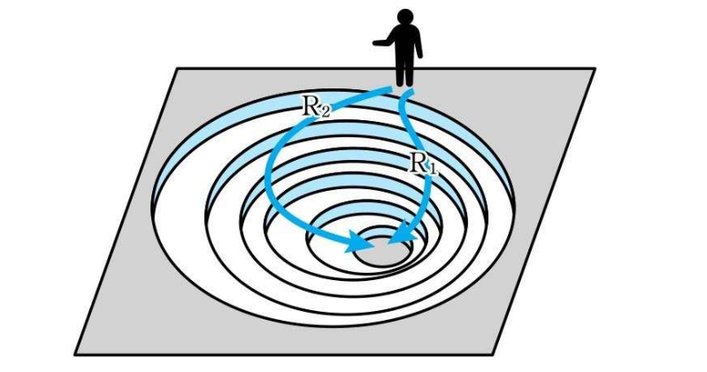

## 前言

本篇主要讲解一个机器学习中很重要但又很基础的概念：梯度下降，经常用于寻找最小值，在近似公式和向量内积的基础上很容易理解

## 正文

### 需要解决的问题和思路

首先，梯度下降是为了渐进的寻找最小值，根据书中的例子，如果我们知道了一个函数 `z = x^2 + y^2`，期望知道当 x 和 y 取什么值的时候，z 取值最小 根据之前偏导数学到的概念，z 关于 x 的偏导数为0，z 关于 y 的偏导数为0，是函数取最小值的**必要条件**  求解出来 x=0,y=0，对应图中的最低点  这个方程相对计算机来说比较难解，需要首先求出偏导数，再进行多元方程求解过程；

### 近似公式和向量内积

在了解梯度下降采用的思路前，先复习下近似公式和向量内积 上一篇关于近似公式的博客讲到 Δz 定义如下：  根据近似公式可以得到：  还有其向量形式  向量内积就联想到了向量内积的最小值性质，在a,b向量反向的时候，内积最小，同向的时候内积最大   单独拿出这两个式子可能并不能立马让脑袋里电光火石，那么观察下面这张图，思考一下如果我们在 (x,y)点 **让Δz最小，是否意味着 x 变动Δx，y变动Δy之后，函数下降最快**（把Δz想成负的），就越快逼近极值点  两个向量内积最小，自然是两个向量方向相反的时候，所以就自然而然的推出来二变量函数的梯度下降基本式   就像是我们在函数的顶部扔了一个小球，每次球运动的时候，都会顺着下降最快的方向运动一定距离，然后停下来重新计算下降最快的运动方向和距离，最后得到的运动轨迹就像R1一般，以最快的方向和位置下降到最低点 

### 多变量下的梯度下降法（重点）

上面主要理解了下两个变量的梯度下降法，主要是因为二维或三维图像相对比较好画并且好理解，但是深度学习中，变量维度非常多，所以只是一个或两个变量的梯度下降需要推广到多变量中。 书中的定义如下：  其中f在点(x1, x2, …, xn)处的梯度如下图所示  所以在深度下降的过程中，只需要算出梯度把每个变量都改变 Δxn，即可逐渐逼近极值 

#### 哈密顿算子▽

为了简化表示，书中降到了哈密顿算子▽，其定义如下   所以梯度下降公式可以简化的表示为 

#### η的含义

可以看到 η 在式子中是一个大于1的微小常数，会影响每次位移的距离（书中形象的比喻为“步长”） 而这个值如果设置过大，可能就会导致越过极值点（因为每次走的步子太大了），反之可能困在非极值点（因为每次走的步子太小了，跨越不过去），据书中所述，这个参数被称为**学习率**，目前还没有一个具体的标准，需要不断地尝试从而获取到最优值。  书中还特意说明了下用η代表步长是不严谨的，因为每次运动时，梯度的大小不一样（向量的大小，用根号x1^2+x2^2...xn^2计算），所以如下公式中的η才是步长 

## 总结

主要介绍了什么是梯度，如何通过让一个函数通过每一点的梯度向量和学习率η趋近于极值，还通过二变量下的梯度下降法推广到适用于神经网络的多变量下的梯度下降法