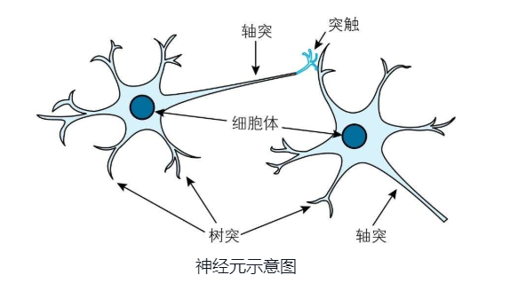
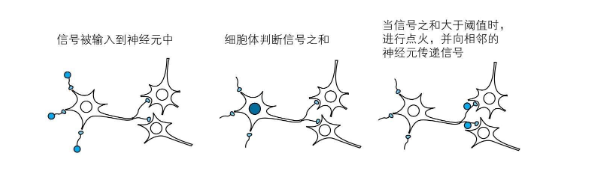
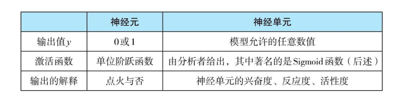
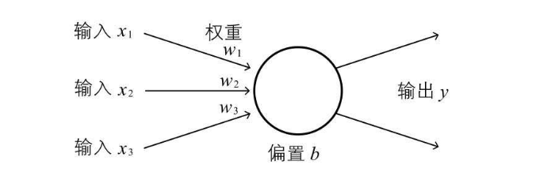
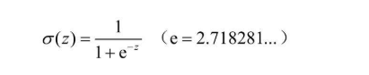
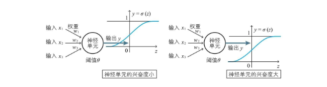

## 前言

阅读《深度学习的数学》书中第一部分提到了关于 神经元、神经单元、激活函数以及一个非常具有代表性的 Sigmoid 函数，本博客的目的既是对此做一个总结

## 正文

### 生物学中的神经元

生物中的神经元可归纳为如下几个知识点 

*   每个神经元由胞体、轴突和树突组成
    *   轴突上的突触可以用来接受其他神经元的信号
    *   树突用来发送信号
*   很多个神经元形成神经网络
*   如果一个神经元收到的其他神经元传递的**带权重信号之和**不超过某个固定大小的值，则不做出任何反应
*   如果一个神经元收到其他神经元传递的**带权重信号之和**超过某个固定大小的值，则向其他相连的神经元传递**固定强度**的信号，俗称**“点火”**

### 深度学习中的神经单元

根据生物学上的神经元规律来看，一个神经单元拥有带权值的一个或多个输入，输出分为『有输出/无输出』，带权值之和大于某个固定值则输出信号 所以，假设神经元输出为 `y`，固定值为 `θ`，输入信号的权值和输入信号的强度为 `wn` 和 `xn` 可得到如下表达式： `w1*x1 + w2*x2 + ... wn*xn < θ => y=0` `w1*x1 + w2*x2 + ... wn*xn > θ => y=1`

#### 数学上的表达

数学上有一个 `单位阶跃函数`的定义，自变量大于0时，函数值为1；自变量小于0时，函数值为0，自变量为0时函数值为不确定或不定义 单位阶跃函数的数学定义如下：  结合神经单元的表达式，可得到 `z = w1*x1 + w2*x2 + ... + wn*xn - θ` **点火**的数学表达式即可确定为 `y = u(w1*x1 + w2*x2 + ... + wn*xn - θ)` 

### 激活函数

上述 **点火** 的数学表达式其实就是一个激活函数，但是 `u` 一般表示单位阶跃函数，`- θ` 也不够一般化，所以式子换成了这个样子： `y = a(w1*x1 + w2*x2 + ... + wn*xn + b)` 输出也不限于 0/1，也可能是其他变量，书中提到可类比 “兴奋度”、“反应度”  其中 `a` 就是激活函数，是建模者定义的函数，有一个代表就是 `Sigmoid` 函数 其中 `b` 被称作 **偏置**，相当于 `-θ`，`θ` 表示一个神经元的感受能力，`θ` 越高越不容易被点火（迟钝），`θ`越低越容易被点火（敏感） 至此 一个神经元可以如下图表示 

#### Sigmoid

激活函数的代表就是 `Sigmoid` 函数，书中介绍其，定义如下：  其函数图像可由下图所示，对应的输入和权重映射到 y 的输出，y越接近1兴奋度越高，越接近0兴奋度越低 

## 总结

由生物学中的神经元特性推导出深度学习中的神经单元模型 在生物学中，对每一组输入的权值求和，超过阈值即输出1（激发态，点火），否则输出0（静息态） 深度学习中的神经单元，使用激活函数来表示一个神经元在一定的输入下的激活状态，表达式如下 `y = a(x1*w1 + x2*w2 + ... xn*wn + b)` 上述表达式中的 `a` 即为激活函数，`b` 为偏置，越高则神经元越敏感 `Sigmoid` 是激活函数的代表，输出接近1表示兴奋度越高，接近0表示兴奋度越低