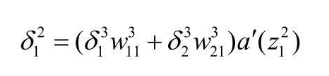

## 前言

本篇博客主要讲神经单元误差的定义及其含义，以及比较重要的误差反向传播法，也就是大名鼎鼎的BP算法

## 正文

### 神经单元误差

#### 梯度下降算法在实际应用中的难点

之前提到的[梯度下降法](https://blog.wj2015.com/2020/03/01/%e6%b7%b1%e5%ba%a6%e5%ad%a6%e4%b9%a0%e7%9a%84%e6%95%b0%e5%ad%a6-%e6%a2%af%e5%ba%a6%e4%b8%8b%e9%99%8d/)，可以通过算偏导数的形式来获得梯度，从而以最快的速度把所有偏导数降到0 但是有一个比较麻烦的问题是，神经网络的规模比较大，将平方误差的式子化简到以神经单元的权重和偏置的表示就很麻烦了，更别说还要**对每个权重和偏置做偏导数**

#### 神经单元误差的定义和含义

书中定义了神经单元误差如下，表示误差函数对某个神经单元的综合输入的偏导数  这个偏导数有什么含义呢？从式子上可以理解为 加权输入 $z\_j^l$ 给平方误差（损失函数）的变化率，根据最小值条件（z是关于权重、偏置的函数），在极值点的时候，这个变化率也应该是0，故可以称之为**误差**

#### 神经单元误差关于权重和偏置的偏导数（重点）

然后下一步就是把这个定义融入到现有的平方误差关于权重和偏置的偏导数中去，希望能得到一个偏导数与神经单元误差的关系 平方误差的式子如下：  PS:本篇博客都用书中提到的 3 \* 4 的黑白图像识别 0/1 的模型作为例子，第一层是输入层，第二层式隐藏层，第三层是输出层  在看推导之前，可以先复习一下单变量和多变量偏导数公式，可以参考之前写的一篇博客 [深度学习的数学原理-复杂函数求导的链式传递及多变量近似公式](https://blog.wj2015.com/2020/02/28/%e6%b7%b1%e5%ba%a6%e5%ad%a6%e4%b9%a0%e7%9a%84%e6%95%b0%e5%ad%a6%e5%8e%9f%e7%90%86-%e5%a4%8d%e6%9d%82%e5%87%bd%e6%95%b0%e6%b1%82%e5%af%bc%e7%9a%84%e9%93%be%e5%bc%8f%e4%bc%a0%e9%80%92%e5%8f%8a%e5%a4%9a/)

##### 关于权重的偏导数推导

根据单变量偏导数公式（设${z\_1^2}$为${w\_{11}^2}$的函数），即可得到如下式子  还是以3 \* 4的黑白图片识别0/1为例子，根据神经单元误差的定义，以及 ${z\_1^2}={w\_{11}^2x\_1}+{w\_{12}^2x\_2}+....+{w\_{12}^2x\_{12}}+{b\_1^2}$ 的关系式，计算一下可以得到 

##### 偏置的偏导数推导

同理，因为b关于z的偏导数是常数1，所以在这个例子中也可以推出误差函数关于某个偏置的偏导数 

##### 公式一般化

这样就把梯度下降中的偏导数求解转换到了求解神经单元误差上 

### 误差反向传播法

#### 输出层的神经单元误差计算

根据平方误差的公式及定义，输出层的神经单元误差是最好计算的，还是那个 3 \* 4 的黑白图识别数字的例子，第三层作为输出层，可以推算出如下公式  一般化后，得到了输出层神经单元误差的计算式 

#### 反向递推关系式(重点)

那么，根据神经单元间的关系，是否能从输出层的神经单元误差**反向推导出前一层神经单元误差**的关系式呢？ 在看推导之前，还是需要复习一下多变量函数偏导数链式法则  同样的 3 \* 4 的黑白图像识别0/1的例子，输出层是第三层，那么$z\_1^3$ 和 $z\_2^3$ 可以用 $z\_1^2$ 表示，所以 C 就可以看作关于 $z\_1^3$ 和 $z\_2^3$ 的复合函数，再把 $z\_1^3$ 对 $z\_1^2$ 的函数看作 $z\_1^3$ 对 $a\_1^2$ 的函数，$z\_2^3$ 对 $z\_1^2$ 的函数看作 $z\_2^3$ 对 $a\_1^2$的函数，根据**单变量偏导数公式** 即可推导出如下结果  把神经单元误差的概念带入进去  根据 z 的定义式，也不难得出  化简一下，即可得到一个递推式  提取相同项，得到如下结果  整理一下，推广到例子中的第二层（隐藏层）  再递推一下，得到每一层的某个神经单元误差与上一层和下一层的神经单元误差关系式  到这里，就可以通过最后一层的神经单元误差，反向推导出上一层的神经单元误差了，一直往前推，就能得到网络中所有的神经单元误差 

#### 通过反向递推公式，对梯度下降法的改进

只需要求输出层的神经单元误差，即可根据反向递推公式推算出上一层的神经单元误差，从而进一步**求出平方误差对每个神经元的偏置或权重的偏导数，进而得到梯度**，就像下图所示  图中的式(11) 表示平方误差对权重/偏置的偏导数的一般公式，可以通过神经单元误差得到梯度中的偏导数 

## 总结

本篇博客主要引入了神经单元误差这一概念，以及将神经单元误差引入到梯度求解中的偏导数式子里边去，并了解了误差反向传播法，通过神经单元误差的递推公式，从最后一层开始推算得出网络中所有的神经单元误差，进而求出梯度