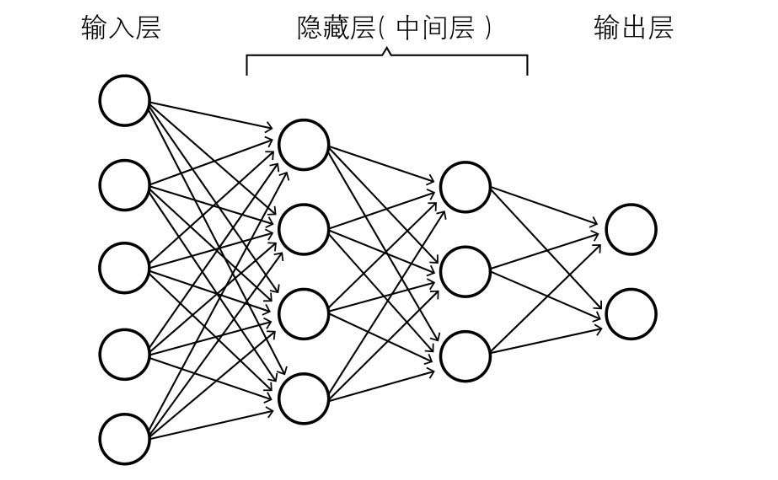
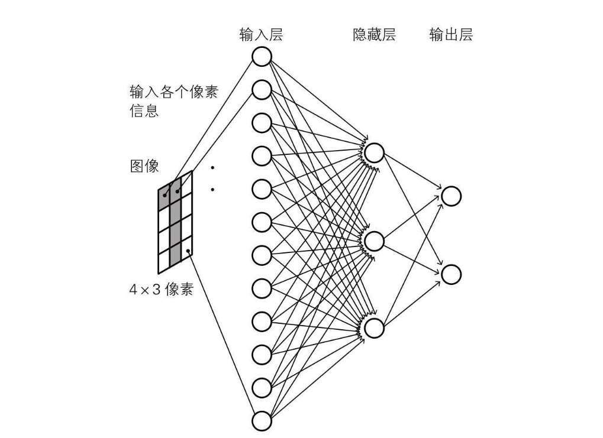
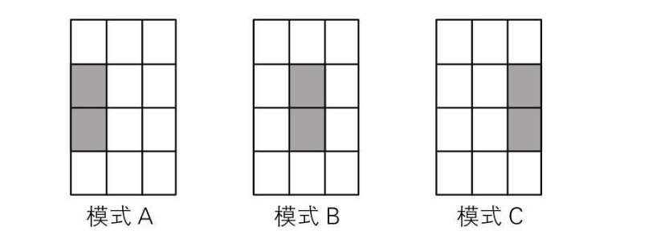
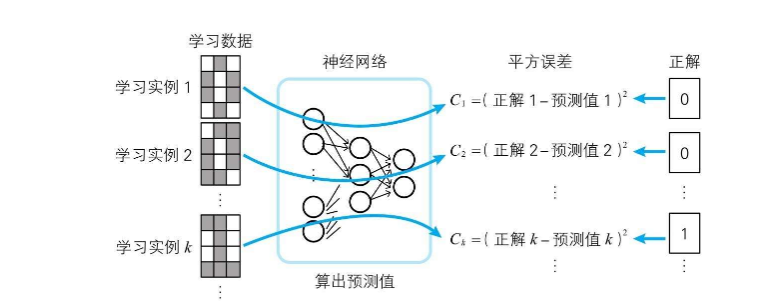

## 前言

前文中了解到，神经网络由多个神经单元组成，而本篇博客将会了解到深度学习由多个神经网络组成，并且分为 输入层、隐藏层和输出层，隐藏层涉及到的知识点最多，是本文的重点

## 正文

阶层型的神经网络主要结构如下图所示，通过输入层激活信号，再通过隐藏层提取特征，不同隐藏层神经单元对应不同输入层的神经单元权重和自身偏置均可能不同，输入层兴奋传递到隐藏层兴奋，最后输出层根据不同的隐藏层权重和自身偏置输出结果 

### 一个例子

借用书中的一个例子，目标是识别一个 4 \* 3 的黑白图像是0还是1，例子中输入层采用了 12 个神经节点来对应 4 \* 3 个像素点，然后隐藏层再使用 3 个神经单元进行特征提取，最后输出层再使用两个神经节点标记识别结果是 0 或 1 

### 输入层

如上图所示，十二个神经单元对应 4 \* 3 像素（黑白），如果该像素是黑的，则对应神经元兴奋，否则静息

### 输出层

输出层负责输出最后结果，输出层有两个节点，如果识别结果偏向0，那么第一个节点兴奋度会高于第二个节点，如果识别结果偏向1，那么第二个节点兴奋度会高于第一个节点

### 隐藏层

背负了 **特征提取** 的伟大使命，隐藏层每一个节点会对输入层的兴奋有不同的接收权重，从而更加偏向于某种识别模式 比如书中举例，隐藏层第一个神经单元对应下图模式A，也就是对应输入层 4、7号神经单元接收权重比较高，对其他神经单元接受权重比较低，如果超过了神经单元自身的偏置（阈值）则会引发隐藏层的兴奋，向输出层传递兴奋信息，隐藏层其他神经单元同理 

### 各个层如何向上传递信息

根据上边的介绍可知，输入层每个神经单元直接对应原始数据，然后向隐藏层提供信息，隐藏层每个神经单元对不同的输入层神经单元有不同的权重，从而偏向于对某种识别模式兴奋；多个隐藏层的神经单元兴奋后，输出层的神经单元根据不同隐藏层的兴奋加上权重后，给到不同的兴奋度，这个兴奋度就是模型最终识别的结果。

#### 神经网络中权重和偏置的作用

根据上述信息可知，权重会影响神经单元对输入信息敏感程度，比如隐藏层的神经单元通过控制权重形成识别模式偏向，输出层的神经单元调整对隐藏层神经单元的权重，可以形成输出结果的偏向； 而偏置，可以理解为敏感度，如果没有设置合适的偏置，一些“噪音”就会影响模型识别的结果，或者一些本该被识别出来的场景，但是在传递过程中被屏蔽掉了。

#### 有监督学习下，如何确认权重

在这里需要引入一个概念，『损失函数』又称为代价函数（cost function），计算方法为预测值与学习资料中偏差值之和(误差)的平方，有监督学习就是经过一些『学习资料』的训练，让模型预测的『误差』尽量的小。 

## 总结

神经网络由多个神经单元组成，深度学习中的神经网络可分为三层，分别是 输入层、隐藏层和输出层，每一层都有对应的神经网络与下一层连接。 输入层主要用于获取输入的信息，比如黑白照片的像素是黑色的还是白色的，大小主要取决于输入信息规模； 隐藏层主要进行『特征提取』，调整权重让隐藏层的神经单元对某种模式形成反应 输出层用于对接隐藏层并输出模型结果，调整权重以对不同的隐藏层神经元刺激形成正确的反应，输出的兴奋度即为结果 其中，偏置（阈值）可以排除一些“噪音”影响，监督学习下通过『损失函数』来衡量模型是否合理，计算方法是 预测值与正解之差(误差) 求和再平方；目标是通过学习资料的训练，让误差更小；