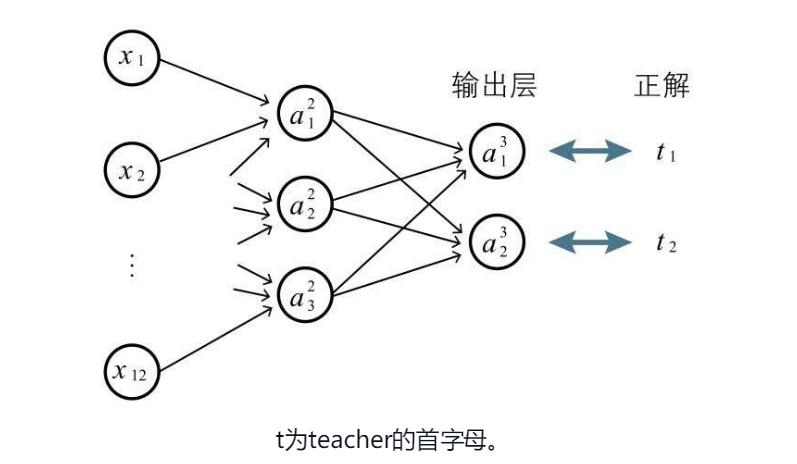
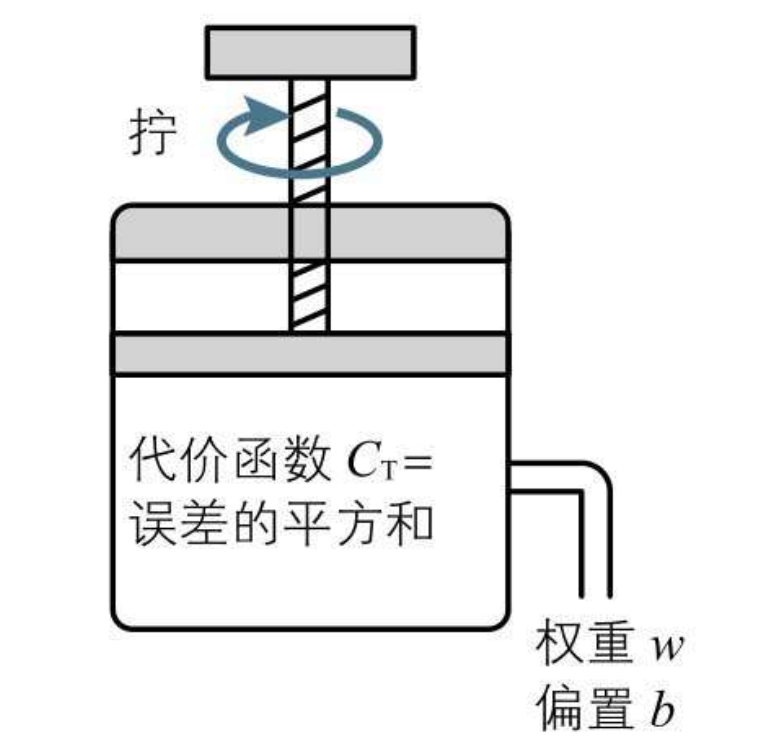

## 前言

本篇博客主要讲解神经网络中的变量表示法、各层的输入输出关系式，了解正解和预测值，代价函数的计算及其最小化，以及参数规模和需要的数据规模计算

## 正文

### 神经网络的参数表示法

据书中表述，神经网络是一种数学模型，像权重和偏置在数学上看就是**参数** 下图中，权重 `w1`/`w2`/`w3` 偏置 `b` 就是神经单元的参数，加权输入即为`z1`，经过激活函数 `a` 的计算得到结果为 `a1` 

#### 命名规则（重点）

上面简单看了下一个神经单元的输入输出表示，但是神经网络由多个层组成，每个层又有多个神经单元，所以需要科学的对这些神经单元编号

##### 层编号

首先，对神经网络的每个层进行编号，从输入层开始数，输入层为`层1`，输出层为最后一层，也就是 `层l`，l表示 last  然后每个层对应的偏置和权重，有如下的规则定义  看表格可能有点难理解，可以参照下图的表现形式，需要着重理解权重(w)的下标有**两个索引**，前面的索引代表**当前层**的第几个神经单元，后边的索引代表**前一层输出**的第几个神经单元   下面是截取的一个 3\*4 的黑白图像识别神经网络，输入层隐藏层和输出层的命名表示 

#### 小练习

这是博主自己编的几个小练习，可以对照下表格第一列理解其输出含义

符号

表示含义

${w\_{11}}^{2}$

第1层第1个神经单元对应第2层第1个神经单元输出权重

${w\_{21}}^{2}$

第1层第1个神经单元对应第2层第2个神经单元输出权重

${w\_{21}}^{3}$

第2层第1个神经单元对应第3层第2个神经单元输出权重

${x\_{12}}$

第一层（输入层）的第十二个神经单元名称 或 输入 或 输出变量

${z\_{2}}^{3}$

第3层第2个神经单元加权输入的变量

${b\_{2}}^{3}$

第3层第2个神经单元的偏置

${a\_{2}}^{3}$

第3层第2个神经单元的输出变量 或 表示该神经单元的名称

#### 多个学习实例的表示方法

可以加上中括号来表示第n个学习实例  下图表示第七个图像输入神经网络时，对应的变量表示方法 

### 关系式

关系式就是用一个式子表示各个变量之间的关系

#### 输入层

输入层的输入即输出，所以有如下的关系式 

#### 隐藏层（中间层）

根据变量的定义，不难得出如下的关系式（z和a定义请见本博客上方表格）  

#### 输出层

输出层也同理可从隐藏层得到 z，经过激活函数后得到输出 a  

#### 矩阵表示法

之前理解过矩阵内积的相关知识，权重之和 z 可以用如下的向量形式表示，有利于编程的实现 

### 正解和代价函数

#### 正解的定义

正解顾名思义就是学习数据中正确的结果，预测值就是输入模型产生出来的结果值 用事先提供的学习数据确认权重和偏置，这个过程在神经网络中被称作**学习**，目标就是让预测值与正解的误差尽可能的小 如下图所示的识别 3\*4 的黑白图像是0还是1，输出层 ${a\_{1}}^{3}$ 敏感度越高，越偏向1，反之结果越偏向0  如果我们得到的学习数据是一张图片对应一个数字 1或0，那么还需要画出表格做出如下定义 实际的学习过程就如下图所示，根据正解和输出层的结果，就可以求误差了  

#### 代价函数

这里引入书中的一段话来表示代价函数，大概意思就是衡量这个模型的误差大小的一个函数

> 在数学中，用模型参数表示的总体误差的函数称为代价函数，此外也可以称为损失函数、目的函数、误差函数等。如前所述（2-12节），本书采用“代价函数”这个名称。

#### 代价函数的计算

代价函数也分很多种，比如最容易理解的每一个学习数据的(正解 - 预测值) ^ 2 之和 

> 书中说明了，1/2 作为常数是为了方便计算

由于对差求平方的代价函数虽然很容易理解，但是存在着计算收敛时间长的问题，为解决这个难点，书中还提到了另外一种误差指标，称为**交叉熵**，提高梯度下降算法的速度 针对本博客上方的两个输出神经单元的例子，定义如下，其中 n 是数据的规模 

#### 代价函数的最小化（重点）

书中给到了如下一张比较容易理解的图，因为代价函数的式子直接体现模型的误差，所以只需要让代价函数尽量小，整个模型契合度就会越高  那么如何让代价函数最小呢，不知道有没有想到之前提到的 **多变量函数求极值** 的问题，多变量函数的极值有一个必要条件，就是 **对每个变量求偏导数，其值均为0** 具体可以见之前写过的一篇博客 [深度学习的数学-导数和偏导数](https://blog.wj2015.com/2020/02/27/%e6%b7%b1%e5%ba%a6%e5%ad%a6%e4%b9%a0%e7%9a%84%e6%95%b0%e5%ad%a6-%e5%af%bc%e6%95%b0%e5%92%8c%e5%81%8f%e5%af%bc%e6%95%b0/#i-12) 但是在实际的训练过程中，求导数的计算量比较大，更多是采用**梯度下降**的方式去求极值 之前也写了相关博客可供参考 [深度学习的数学-梯度下降](https://blog.wj2015.com/2020/03/01/%e6%b7%b1%e5%ba%a6%e5%ad%a6%e4%b9%a0%e7%9a%84%e6%95%b0%e5%ad%a6-%e6%a2%af%e5%ba%a6%e4%b8%8b%e9%99%8d/)

#### 神经网络的代价函数

还是以 3\*4 图片识别0/1的神经网络为例  假设有64张图片，则其误差可以表示如下  然后把每张图片（学习资料）的误差加起来，就得到了代价函数 

#### 参数和数据规模的计算（重点）

书中提到了参数规模的最小值估算方法，就是把所有的权重、偏置都数起来，因为这些都是需要通过学习资料去确定的参数  书中提到，数据的规模如果小于参数的规模，就无法确认模型，所以最小数据规模就是所有参数的个数，3\*2图像的那个例子学习用的图像至少需要47张

## 总结

本篇主要记录神经网络的参数表示法，每个层每个神经单元的关系式，正解和代价函数，以及代价函数最小化、参数和训练数据规模等