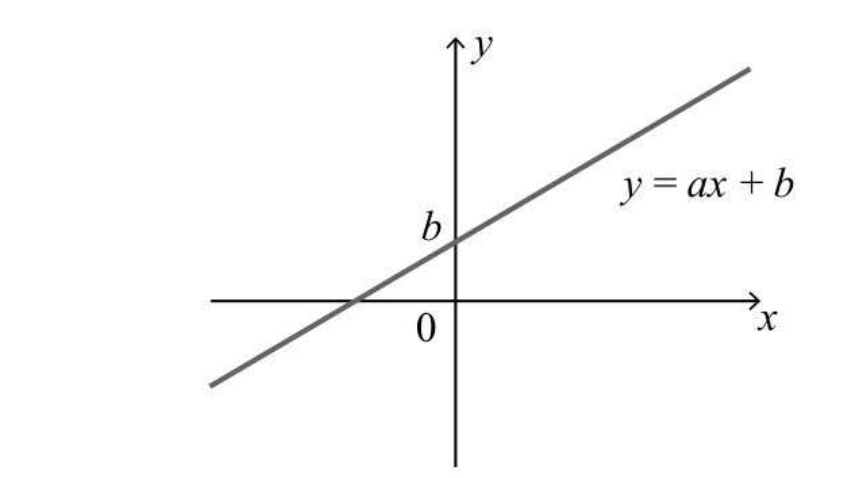
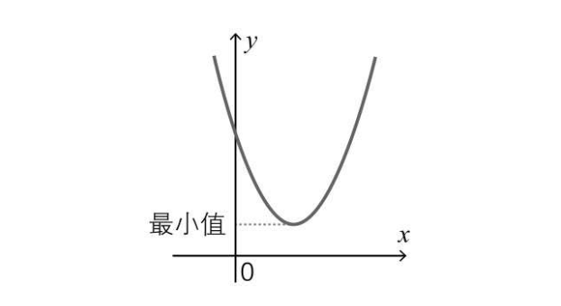
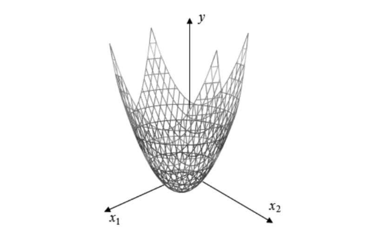
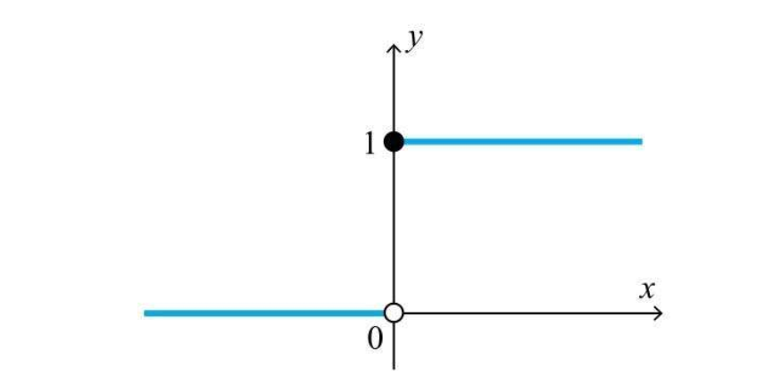
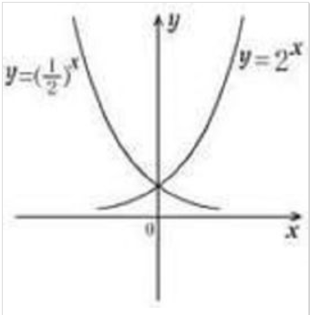
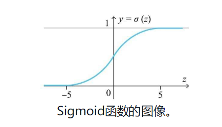
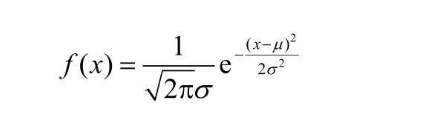
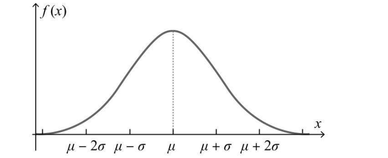

## 前言

本篇博客主要介绍深度学习中需要掌握的函数，包括一次函数、二次函数、单位阶跃函数、指数函数、sigmoid函数等概念

## 正文

### 一次函数及多元一次函数

首先时最基础的一次函数，中学数学告诉我们，一次函数满足表达式 `y = a*x + b`，其中 `a` 是斜率表示直线的倾斜程度，`b`是截距表示x=0时直线与y轴交点的y值  在之前的章节中，提到了神经单元会根据多个输入乘以权重，根据是否到达临界值 θ ，从而判断自身是否兴奋，其数学表达式可以表现为如下形式： `z = w1*x1+w2*x2+w3*x3 + ...wn*xn + b` 书中提到，由于一次函数的特性，x1,x2,x3...xn 为确认值的时候，输入z，w1,w2,w3...wn,b 是一次函数关系，使用 『误差反向传播法』推导时，会相对简单

> 误差反向传播法 自从40年代赫布(D.O. Hebb)提出的学习规则以来，人们相继提出了各种各样的学习算法。其中以在1986年Rumelhart等提出的误差反向传播法，即BP(error BackPropagation)法影响最为广泛。 　BP算法的基本思想是，学习过程由信号的正向传播与误差的反向传播两个过程组成。 　　1）正向传播：输入样本－>输入层－>各隐层（处理）－>输出层 　　注1：若输出层实际输出与期望输出（教师信号）不符，则转入2）（误差反向传播过程）。 　　2）误差反向传播：输出误差（某种形式）－>隐层（逐层）－>输入层 其主要目的是通过将输出误差反传，将误差分摊给各层所有单元，从而获得各层单元的误差信号，进而修正各单元的权值（其过程，是一个权值调整的过程）。 　　注2：权值调整的过程，也就是网络的学习训练过程（学习也就是这么的由来，权值调整）。

### 二次函数及多元二次函数

根据中学的数学知识可知，一元二次函数表达式为 `y = a*x^2 + b*x + c (a!=0)`，函数图像如下，特点是存在一个全局最小值(或最大值)  而拥有两个变量的二次函数，数学表达式就是这样 `y = a*x1^2 + b*x2^2 + c*x1*x2 + p*x1 + q*x2 + r` 画在三维坐标系上，就会是这样，依旧能找到y的全局最低点/最高点 

### 单位阶跃函数

该函数定义十分简单，x小于0时，函数值为0，x大于等于0时，函数值为1，一般作为激活函数

> 所谓激活函数（Activation Function），就是在人工神经网络的神经元上运行的函数，负责将神经元的输入映射到输出端。

简单意思就是说，输入需要到达一定的阈值才能被激活，就像之前的神经单元激活函数可以表现为 `y = u(w1*x1 + w2*x2 + ... wn*xn - θ)`，其中θ就是阈值 

### 指数函数

指数函数的数学表达式为 `y = a^x(a为正常数，且不为1)`，`a` 称为指数函数的底数，其中有一个特殊的底数 e=2.71828，称之为自然对数的底，有很多神奇的性质； 更多关于e的前世今生可以观看这个视频：https://www.bilibili.com/video/av27013943 

### sigmoid函数

sigmoid函数是及学习中非常著名的激活函数，与前方提到的单位阶跃函数不同，**sigmoid函数是光滑的随处可导**，单位阶跃函数在0处不可导 函数表达式如下所示，exp是指数函数的简略记法  

### 正态分布

在实际建模过程中，需要对神经单元的权重和偏置设置初始值，而初始值设置是随机的，使用满足动态分布的随机数，比较容易取得好结果  其中，μ是期望值，σ是标准差，其图形如下，横轴表示样本的值，纵轴表示出现的概率，预测变量时就可以根据概率曲线对其发生的概率进行预测 

## 总结

本片博客中主要介绍一些函数相关的知识，比较重要的就是 单位阶跃函数和sigmoid函数以及正态分布，还引出了激活函数等概念。