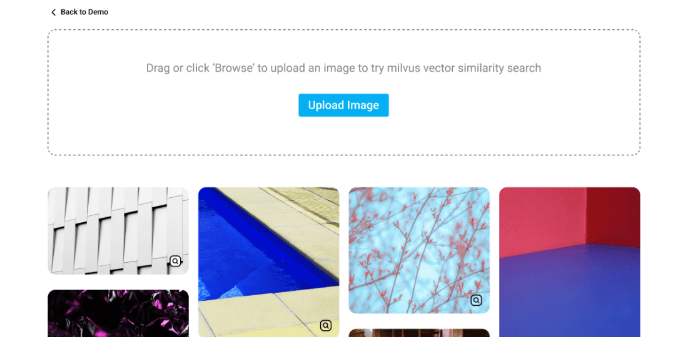

## 前言

文本嵌入模型是大语言模型的基石和早期雏形，大语言模型则是文本嵌入模型结合“动态上下文理解”产生的巨大飞跃，这篇博客会从文本嵌入出发，由浅入深去探索文本嵌入、向量数据库、RAG 的本质。

## Text Embedding： 让机器也能读懂文字的含义

### 先从一个简单问题开始

想象一下，电脑能直接理解“苹果”这个词吗？

当然是不能。电脑只认识数字，比如 `010101`​。对于电脑来说，“苹果”、“香蕉”、“手机”这些词本身没有任何区别，只是一串不同的符号。

**那么我们如何让电脑理解 “苹果”和“香蕉”是近义词（都是水果），而和“电脑”关系较远呢？**

很容易想到，**把词语句子转译成一串数字计算机处理处理起来就方便了，** 这里提到的转译结果，就是 **Text Embedding**，处理转译任务用到的模型就是 **Text Embedding Model**。

> 注1：也可以给视频、图片、音频等多媒体输入做转译，相关的模型有 ViT、`multimodalembedding`​等多模态 Embedding 模型。
>
> 注2：Embedding 的中文翻译是嵌入，直译听起来有点不明就里，不过概念理解一致即可。

<!-- > 生成提示词：展现一下词嵌入转译官模型的画面，宫崎骏画风，工厂忙碌的背景，顶部红色横幅写着“词嵌入模型”，中间有一个可爱的机器人，肚子上写着“Text Embedding”站在流水线的背后用手臂工作，流水线的左边是“Word”字样的箱状货品，右边是“Vector”字样的纸张叠在一起的样子 -->


---

### 什么是 Text Embedding？

**Text Embedding** 是一种技术，它能将文本（单词、句子或整个段落）转换成一个由数字组成的列表，这个列表我们称之为 **向量**。

这个向量可以具象的想象成一个非常多维的空间坐标，这个空间可以被称为**语义空间**，列表的长度就是空间的维度。

> 核心思想：意义相近的文本，它们对应的“坐标”在空间中的距离也相近。

**举个例子：**

假设我们能把词语映射到一个二维平面上（实际上的维度要高得多，有几百甚至上千维）。

- ​`苹果`​ 的坐标可能是 `[0.8, 0.7]`​
- ​`香蕉`​ 的坐标可能是 `[0.75, 0.65]`​
- ​`电脑`​ 的坐标可能是 `[-0.9, -0.8]`​

你会发现，`苹果`​ 和 `香蕉`​ 的坐标点在图上离得很近，而它们都离 `电脑`​ 很远。这样，计算机通过计算坐标之间的距离（比如欧氏距离），就能让程序理解词语之间的关系了。

<!-- > 宫崎骏画风，带点科技感，hacker帝国的感觉，顶部中等字号的标题是“语义空间”，一个很小的人背对画面站在右下角，画面整个区域都是蓝色的空间，空间中有一些闪亮的光点，有三个特殊的光点，零散的表示着苹果、香蕉、电脑 -->


**词向量的数学性质:**

一个更有代表性的例子，著名的 `King - Man + Woman ≈ Queen`​

- ​`向量("国王") - 向量("男人") + 向量("女人")`​
- 计算出的结果向量，会和 `向量("女王")`​ 的坐标非常非常接近

这表明，Embedding 不仅编码了“是什么”，还编码了词语之间复杂的**语义关系**。


---

### Embedding 是如何生成的？

上文中提到的翻译过程不是人为设定的，而是让 AI 模型在海量的文本数据（比如整个维基百科、数字化的书籍、网页）上学习提炼出来，相当于 AI 模型通过阅读大量材料，自己总结出了规律。

**演进历程：**

1. 早期阶段 (Word2Vec, GloVe 等):

    - **核心思想：** 一个词的意义由它周围的词来定义（“近朱者赤，近墨者黑”）。
    - **工作方式 (以Word2Vec为例)：**  模型在阅读海量文本时，会尝试做“完形填空”。比如看到句子 “一只__在树上唱歌”，模型会去预测中间的词是 “鸟”。模型不断地进行预测和修正词的向量坐标，慢慢就能学会了每个词的向量表示。
    - **缺点：** 无法处理一词多义的情况。比如 "bank" 在 "river bank" (河岸) 和 "investment bank" (银行) 中，用 Word2Vec 得到的 Embedding 是一样的，这与实际情况相差甚远。
2. 现代阶段 (基于 transformer 架构的 Embedding 模型，如 `text-embedding-3-large`​、`qwen3-embedding`​等\):

    - **核心思想：** 词语的意义依赖于其所在的上下文 (Context)。
    - **工作方式：** 这类基于 Transformer 架构的 AI 模型在处理一个词时，会同时考虑到整个句子的所有其他词。AI 模型通过注意力机制来判断句子中哪些词对当前词的意义影响最大。
    - **优势：** 能够较好的解决一词多义问题。对于 "river bank" 和 "investment bank"，文本向量模型会根据上下文，为 "bank" 生成两个完全不同的 Embedding 向量。
    - **劣势：** 模型相比传统词向量一般要大，推理成本和训练成本高


现在我们通常使用的 Embedding 模型都是像 openai 的 `text-embedding-3-large`​ 这样能够理解上下文的强大模型。

**需要注意的是：**  Embedding 模型和大语言模型虽然大多数都基于 Transformer 架构，但本质上存在很大区别。大语言模型的输出结果是推理的新文本，主要用于推理，而 Embedding 模型输出的是向量，主要用于捕捉语意方便后续检索。

|特性|Text Embedding 模型|大语言模型 (LLM)|
| ------| ---------------------------------------------| -----------------------------------------------------------|
|**核心功能**|文本理解与量化|文本理解、推理与生成|
|**输入**|文本 (Text)|文本 (Text)|
|**输出**|**数字向量 (Vector)**|**新的文本 (Text)**|
|**主要目标**|捕捉语义，用于机器后续处理|模仿人类进行对话、创作和推理|
|**典型应用**|相似度搜索、文本分类、聚类、RAG中的检索环节|聊天机器人、内容创作、代码生成、摘要总结、RAG中的生成环节|
|**与对方关系**|LLM 的**基础组件**和**输入预处理器**|Embedding 模型的**超集**和**能力扩展**|

---

## 向量数据库：Embedding 的图书馆

### 有了 Embedding ，下一步能干什么

看到这里，我们已经能把任何文本都转换成向量（坐标）了。假设有一个包含数百万篇文章的知识库，现在我们想做一个智能问答机器人。

**用户的提问流程大概是这样的：**

1. 用户提问：中国的首都是哪里？
2. 你用 Embedding 模型将这个问题转换成一个向量 `V_query`​。
3. **下一步怎么办：** 需要从你的数百万篇文章中，找到和这个问题最相关的文章。

**朴素算法：**   
遍历每一篇文章，把它也转换成向量 `V_doc`​，然后计算 `V_query`​ 和 `V_doc`​ 之间的距离。最后，找出距离最近的那几篇。

**问题在于：** 如果有一百万篇文章，你就要做一百万次向量计算和比较。时间复杂度 O(n)，这对业务来说是不可接受的。

那这个时候向量数据库就很有用场了，因为它就是被设计用于高效迅速解决匹配查询问题的。

---

### 什么是向量数据库？

向量数据库 (Vector Database) 是一种专门为海量高维向量的 **存储、管理和高效检索** 而设计的数据库。

**它的核心任务就是：** 当你给它一个查询向量时，它能极快地返回与这个向量最相似的 N 个向量。这个过程叫做 **近似最近邻搜索 (Approximate Nearest Neighbor, ANN)** 。

整理了一张向量数据库和关系型数据库的对比表

|对比维度|关系型数据库 (如 MySQL)|向量数据库|
| ----------| --------------------------------------------------------------------------------| -------------------------------------------------------------------------------------------------------------------------------|
|**核心功能**|精确存储和检索**结构化数据**，保证数据的一致性和完整性。|高效存储和检索**高维向量数据**，发现数据间的语义或特征相似性。|
|**数据模型**|二维表格（行和列），数据有严格的预定义模式（Schema）。|向量（高维浮点数数组）和可选的元数据（Metadata）。向量通常由 AI 模型生成。|
|**查询方式**|使用 SQL 语言进行精确条件查询。|通过输入一个**查询向量**，来查找与之最相似的 N 个向量（Top-K 近似最近邻搜索）。|
|**查询逻辑**|**精确匹配**：基于布尔逻辑（是/否），如 `WHERE id = 123`​ 或 `age > 30`​。|**相似度匹配**：基于距离计算（如欧氏距离、余弦相似度），返回“有多像”，而不是“是不是”。|
|**索引技术**|**B-Tree 或 B+Tree 索引**：非常适合精确值的快速查找和范围查询。|**ANN (近似最近邻) 算法**：如 HNSW, IVF, LSH 等，用于在海量高维空间中快速找到近似的邻居。|
|**处理数据类型**|主要处理结构化的标量数据，如整数、字符串、日期、布尔值等。|主要处理**非结构化数据**（文本、图片、音频、视频等）转换后的**数学表示——向量**。|
|**查询示例**|​`SELECT * FROM users WHERE name = '张三';`​|​`find_similar_vectors(query_vector, k=10)`​|
|**适用场景**|- **OLTP 系统**：用户管理、订单系统、库存管理<br />- **业务分析**：财务报表、销售统计<br />- 任何需要**精确、事务性**操作的场景|- **AI 应用**：以图搜图、人脸识别<br />- **语义搜索**：比关键词搜索更懂你的意图<br />- **推荐系统**：推荐与你喜欢的商品/内容相似的东西<br />- **大型语言模型 (LLM)** ：为AI提供长期记忆、知识库问答|
|**性能关键**|**精确查找的速度**：能否通过索引快速定位到具体的某一行或某几行。|**相似性搜索的速度和精度**：能否在亿万级向量中，毫秒级地找到最相似的一批结果。|

<!-- > 宫崎骏画风，老式图书馆的借阅台中一位年轻姑娘碰着一本书“ANN Indexing”看着镜头，桌面左侧有“向量数据库”的铭牌 -->


---

#### 向量数据库召回技术细节

为什么向量数据库能那么快呢？因为它没有“暴力”地逐一比较，而是使用了一些非常高效的 **ANN 索引算法**。这些算法的核心思想都是 **降维或分治**，通过牺牲精度来换取巨大的速度提升。

### **ANN 搜索主流算法对比**

|方法类型|代表性算法/技术|核心原理|优点|缺点|
| -----------------------| ---------------------------------------| -------------------------------------------------------------------------------------------------------------------------------------------------------------------------------------------------------------------------------------------------------------------------------------------------------------------------------------------------------------| --------------------------------------------------------------------------------------------------------------------------------------| ------------------------------------------------------------------------------------------------------|
|**基于树的方法** (Tree-based)|**Annoy**|通过随机选择的超平面，递归地将整个向量空间分割成多个子空间，构建成二叉树（或多叉树）结构。查询时，通过遍历树来定位查询向量所在的子空间，并对该子空间及其邻近子空间内的向量进行搜索，从而限定搜索范围。|1. 实现原理相对简单。<br />2. 索引构建后内存占用较少。|为达到高精度，通常需要构建多棵树（森林），导致查询时需合并多棵树的结果，增加了查询时间开销。|
|**基于哈希的方法** (LSH)|**Locality-Sensitive Hashing (LSH)**|采用局部敏感哈希函数族对向量进行映射。这类函数的特性是：原始空间中距离相近的向量，经过哈希映射后，以高概率落入同一个哈希桶（bucket）。查询时，计算查询向量的哈希值，仅在对应的哈希桶中检索候选近邻点。|1. 具备严谨的理论保证。<br />2. 天然支持流式数据处理（新数据可独立哈希，无需重构整个索引）。|在高维数据下，为保证高召回率，需要构建大量的哈希表，导致内存消耗显著增加，实际性能常被其他方法超越。|
|**基于图的方法** (Graph-based)|**HNSW** (Hierarchical Navigable Small World)|结合了可导航小世界网络（NSW）和分层思想：<br />1. **邻近图构建：**  为所有向量构建一个邻近关系图，每个节点（向量）仅与其最近的若干邻居相连。<br />2. **贪心搜索：**  查询时，从一个入口点开始，在图中迭代地向着与查询目标更近的邻居节点移动，直到找到局部最优解。<br />3. **分层加速：**  构建一个多层图结构，上层图稀疏，下层图密集。查询从顶层稀疏图开始快速定位，再逐层下降至密集图进行精确查找，大幅提升搜索效率。|1. 查询速度极快，召回率高。<br />2. 在多个基准测试中展现出卓越的综合性能，是当前的主流高性能方案。|1. 索引构建过程计算密集，耗时较长。<br />2. 图结构本身需要较大的内存开销。|
|**基于量化的方法** (Quantization-based)|**PQ** (Product Quantization)|一种有损压缩技术。将高维向量分割为多个低维子向量。对每个子向量空间独立运行聚类算法（如K-Means）以生成一个码本（codebook）。每个子向量由其所属聚类中心（质心）的ID来近似表示。最终，原始向量被编码为一组紧凑的码字ID，以减少存储和计算开销。|1. 通过向量压缩，显著降低索引的内存占用。<br />2. 适用于海量（十亿级别以上）数据集。<br />3. 通常与其他索引结构（如IVF）结合使用，提升性能。|量化过程是有损的，会引入量化误差，从而在一定程度上降低查询精度。|

现代向量数据库（如 Milvus, Weaviate, Pinecone）通常会组合使用这些技术。

比如，先用 `IVF`​ (Inverted File) 进行一次粗粒度的“分区筛选”，然后在每个分区内部再使用 `HNSW`​ 或 `PQ`​ 进行精细的查找，以平衡速度、内存和精度。

安利一个很赞的开源向量数据库 [Milvus](https://github.com/milvus-io/milvus?tab=readme-ov-file)，可以实现诸如全文检索、多模态召回、多模态相似性搜索、电影推荐等场景，本身支持分布式部署和 GPU 加速，非常强大！

​

---

### RAG：检索增强生成

RAG 的英文全称是 Retrieval-Augmented Generation，意为**检索增强生成**，它的核心技术就是上文提到的文本向量模型和向量数据库，它是一个两阶段的过程：

1. **检索（Retrieval）** ：根据用户提出的问题，从一个外部的、可信的知识库中，精准地找出最相关的几段信息。
2. **增强生成（Augmented Generation）** ：将用户原始的问题和上一步检索到的相关信息，一起打包成一个新的、内容更丰富的提示（Prompt），然后提交给 LLM，让它基于这些给定的信息来生成最终的答案。

<!-- > 宫崎骏画风，书桌上，一个机器人身体上延展出来有六只手，机器人双手拿着笔在纸上写“Prompt”，左右各两只手拿着书“RAG” -->


#### RAG 的完整工作流程

##### **阶段一：数据准备（离线处理）**

这个阶段是数据的预处理过程，在用户开始提问之前就需要完成。

1. **数据加载**：首先需要**根据实际业务需求确定知识来源**。可以是公司的内部文档（PDF, Word, Confluence）、网站内容、产品手册、数据库记录等。
2. **文本切分**：一篇长文档对于检索来说太大了。如果直接检索整篇文档，信息的噪音会比较大。因此我们需要将文档切分成更小的、有意义的文本块。

   - 常见的切分办法有：按段落、按固定字数，或者用更细致合理的规则、AI 大模型清洗等方式切分，确保每个 chunk 都包含一个相对完整的信息点。
3. **向量化（Embedding）** ：这是最关键的一步。使用上文提到的**文本嵌入模型（Embedding Model）** ，将每一个文本块转换成一个高维的数学向量（也就是 Text Embedding）。这个向量可以被认为是该文本块在“语义空间”中的坐标。**语义上相近的文本块，其对应的向量在空间中的距离也更近。**
4. **数据索引与存储（Indexing**  **&amp;**  **Storage）** ：将生成的向量连同其原始文本块一起，存储到一个专门的数据库中。这种数据库被称为**向量数据库（Vector Database）** ，它经过特殊优化，能够极快地进行大规模向量的相似度搜索。

至此，知识库就准备好了，它现在是一个被向量化、索引化的、可供快速检索的状态。

‍

##### **阶段二：问答处理（在线处理）**

这个阶段的逻辑是用户真正提出问题时触发的

1. **用户提问**：系统接收到用户的提问，例如：“Apple 公司的最新产品 VisionPro 有哪些核心功能？”
2. **查询向量化**：和数据准备阶段一样，系统使用**同一个**嵌入模型，将用户的提问也转换成一个查询向量。

   - 注意：不同 Embedding 模型的向量维度和推理结果都不一样，所以这里一定需要使用同一个 Embedding 模型进行查询向量化。
3. **向量检索**：系统拿着查询向量去向量数据库中进行相似度搜索。目标是找到与查询向量在语义空间中距离最近的文本块向量。通常我们会取出最相似的 Top-K 个结果（比如 K\=3 或 5）。这些被检索出来的文本块就是与问题最相关的信息。
4. **构建增强提示**：现在，系统拥有了两部分信息：

    - 用户的原始问题：来自用户提问
    - 检索到的相关文本块：来自向量检索
    - 将这两部分信息拼接成一个结构化的提示即可。这个 Prompt 通常会这样设计：

    ```
    请根据以下提供的上下文信息来回答用户的问题。如果上下文中没有足够的信息来回答，请明确告知。

    上下文信息：
    - [文本块1]
    - [文本块2]
    - [文本块3]

    用户问题：
    我们公司最新的AI产品‘VisionPro’有哪些核心功能？
    ```
5. **LLM 生成答案（Generation）** ：将这个增强后的 Prompt 发送给大型语言模型（如 GPT-4.1）。LLM 会严格依据你提供的上下文信息，进行阅读、理解、总结，并生成一个精准的答案。比如它会回答：“根据提供的资料，‘VisionPro’的核心功能包括：空间计算能力、三维用户界面、以及与现有 Apple 生态的无缝集成。”
6. **答案返回与溯源**：最终的答案会返回给用户。一个优秀的 RAG 系统还会同时返回它参考了哪些原始文本块，这样用户就可以自主点击查看来源，验证信息的准确性，极大地增强了系统的可信度。

**所以RAG 框架的核心流程是：** 先通过`文本嵌入`​将知识源向量化，再将这些向量存入`向量数据库`​以待检索，最终在生成任务中，通过检索出的精确上下文来引导大语言模型，从而输出更可靠的答案。

## 总结

**文本嵌入**的本质是将任何文本片段（词、句、文档）转换为一个高维、稠密的数字向量的过程，其核心在于让语义相似的文本在向量空间中的位置也相互靠近。

**向量数据库**是一种专门用于高效存储、索引和查询海量高维向量的系统，其核心能力是基于向量间的距离或相似度，快速执行“近似最近邻”（ANN）检索。

**RAG** 的本质是一种通过从外部知识库中检索相关信息、并将其作为上下文注入到大语言模型提示词（Prompt）中的技术框架，用以增强模型回答的事实准确性和时效性。
