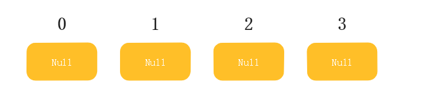
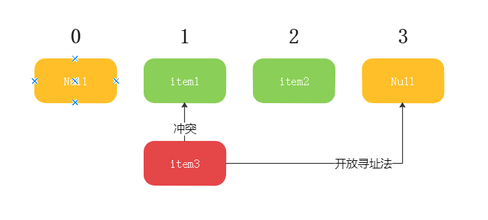
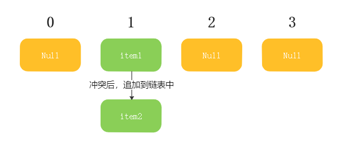
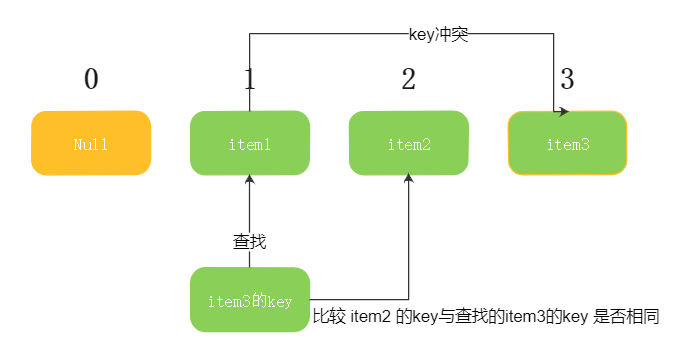
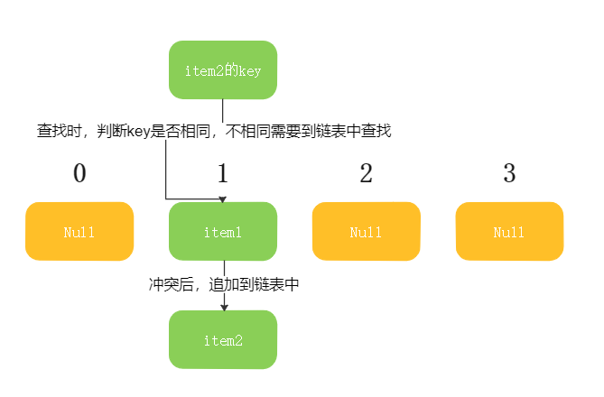
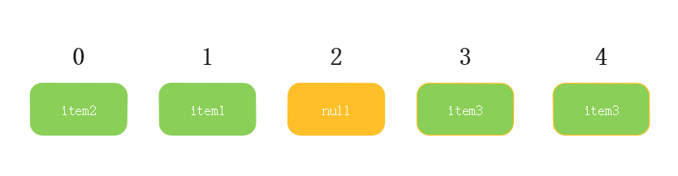

## 前言

本篇博客主要分享数据结构中关于散列表的定义和编程实现

## 正文

### 什么是散列表

散列表也成为Hash表，用于存储 Key 和 Value 的集合，对于某一个Key，散列表能以接近O(1)的时间复杂度获取到对应的value

#### Hash的数据结构

散列表读取的时间复杂度能达到 O(1)，这与其结构脱不了干系 学过基础数据结构都应该知道，通过数组的索引进行顺序读写时间复杂度就是O(1)，那么Hash就借用了这一特点 在进行数据存储或者读取的时候，首先通过**散列函数**计算出Key这个字符串对应的数字，简单取模，得到 0~当前数组长度的一个索引，根据索引顺序存取，时间复杂度就是O(n)

#### 存储数据的数组

如下就是Hash表存储数据的数组的示意图，其中长度为4 

#### 散列函数

#### Hash的负载因子

负载因子用于表示Hash的空间使用程度，计算公式为 Hash有效数据长度/数组长度（空间） 负载因子越高，Hash的查找效率可能就会收到影响，因为负载因子越高就越容易出现**Hash冲突**，无论是开放寻址法还是链表法都会让查找速度降低 一般在负载因子达到一定限制的时候，Hash就需要自动扩容，以保证足够的查找性能

##### 开放寻址法

当Hash冲突的时候，存放元素的时候往后移至空位，查找到对应索引时如果当前索引已经存在元素，那么就往后找到一个空白的位置放入 

##### 链表法

当Hash冲突后，存放元素的item中的链表指针域往后追加新的元素 

### Hash结构的几个操作

#### 读操作

##### 开放寻址法的读操作

开放寻址法中，由于冲突时元素向后查找空位，所以查找的时候需要判断查找的key和存储的key是否相同，不相同的时候需要向后查找相同key的元素，直到为空或者找到相同key的元素 

##### 链表法的读操作

链表法中，冲突元素直接挂在Hash数组的指针域中，所以查找的时候，首先判断查找的key和存储在数组中的key是否相同，不相同的时候需要在指针域对应的链表中查找（时间复杂度O(N)） 

#### 写操作

##### 开放寻址法的写操作

先使用散列函数计算key对应的索引，如果冲突，则往后查找到一个非空的位置写入 

##### 链表法的写入

散列计算key对应的索引，如果冲突，追加到数组元素中的链表域

#### 扩容

无论是开放寻址法还是链表法，扩容都需要新建一个哈希表，重新计算Hash值之后返回新的哈希表 负载因子过小的时候也可以触发收缩，重新计算所有元素的Hash值，以节省空间 

## 总结

本篇介绍了Hash表的数据结构基础，以及两种解决Hash冲突的策略，以及对应策略的读取、写入、扩容操作的底层操作