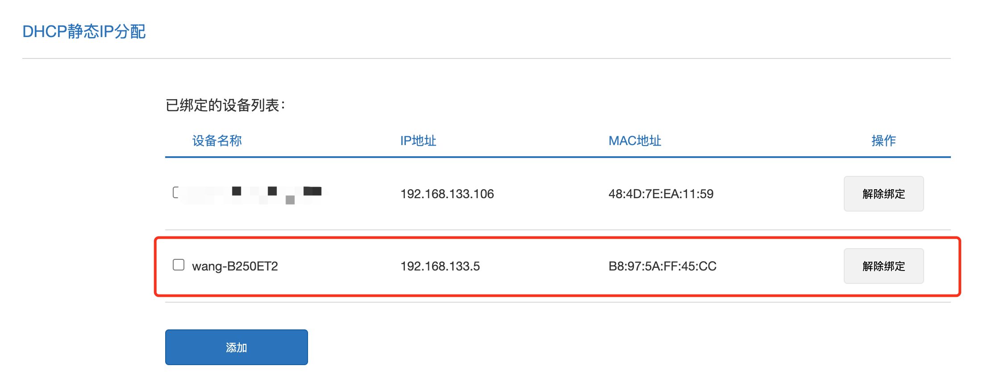
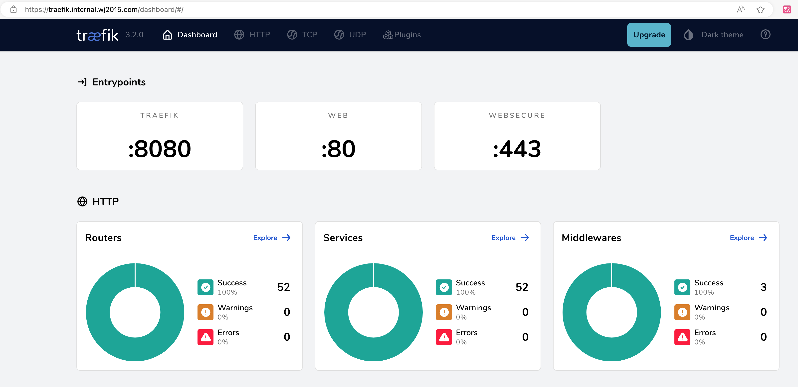

## 前言

对于一个喜欢折腾的人来说，NAS 上总会有各种各样的服务，有用 docker 跑的服务，有用系统服务运行的服务，他们大都挂在一个端口上，例如 `http://192.168.133.5:8190`​，时间久了自己都不记哪个端口对应哪个服务，所以一般还会做一个导航页作为统一入口，维护所有服务。

​​

如果能用项目名称 + 域名的方式访问网站，那看起来会优雅很多（比如 `https://open-webui.internal.wj2015.com`​），以及有些服务需要用到浏览器的最新能力，比如录音、视频等，而这些能力需要在安全的 HTTPS 下才可以被正常使用（[MDN-getUserMedia()](https://developer.mozilla.org/en-US/docs/Web/API/MediaDevices/getUserMedia)），所以本文会介绍博主的诸多本地服务如何批量且自动的加上 HTTPS 和子域名。

​​

> 顺口吐槽一句，现在云厂商可以申请的免费证书都不超过3个月，单独购买证书又贵的一匹，同样可以用下面提到的证书申请方案解决。

## 准备工作

需要的资源如下：

* 首先需要有一个域名，域名可以在腾讯云、阿里云、百度云等有域名购买入口的云服务提供商那边买，域名会解析到内网服务，所以 **域名无需备案**。
* 需要一台 NAS 或 Linux 服务器，arm 或 x86 架构都可以，重点是需要支持 docker，博主的 NAS 是捡垃圾拼出来的组装机，装了 ubuntu 22.04 系统配合 docker 提供服务，从原理上看群辉、飞牛这些支持运行 docker 容器的 NAS 专用系统也可以。

> 注意：做 HTTPS 这里域名一定要购买，不能只在内网 DNS 服务器做域名解析，因为申请证书时需要做 DNS 验证

## 整体思路

大概分为如下几个步骤：

* 将内网 IP 固定下来，可通过路由器自带的 MAC 绑定功能实现，比如固定为 192.168.133.5
* 把域名的一个子域使用 DNS 泛解析的方式解析到内网 IP 上，比如把 ` *.internal.wj2015.com`​ 解析到 192.168.133.5
* 运行 certd 服务和 traefik 服务并做配置
* 给需要的服务动态添加 traefik 代理配置

## 具体操作

### 固定内网 IP

博主家的路由器是小米 AX3000T，而博主的 NAS 机器是挂在小米路由器下的，所以家里网络的 DHCP 在小米路由器中配置。

如果你的 DHCP 服务跑在做软路由上，需要在软路由的 DHCP 中找到 DHCP 静态 IP 分配的配置。

​​

添加一个这样的绑定即可。

​​

> 注：如果绑定的 IP 和 NAS 现有 IP 不一样，可以重启 NAS 或重新获取 IP。

配置完能 ping 通即可

​​

### 添加泛解析

博主域名是在腾讯云买的，所以进入 [域名注册-控制台](https://console.cloud.tencent.com/domain/all-domain/all)，添加一条这样的泛解析

​​

本地可用 `nslookup`​ 或者 `ping`​ 命令确保解析正确，一般配完就生效，不会超过配置的 600s TTL。

​​

### 运行容器

这里用 docker-compose 进行部署（linux 环境下可参考 [docs.docker.com/compose/install/linux/](https://docs.docker.com/compose/install/linux/) 进行 docker-compose 的安装），docker-compose 配置中的所有属性都可以对应到群辉或飞牛系统的 docker 控制台。

> 注：这个 docker-compose 包含三个应用
>
> * 一个是 alist，一个网盘挂载服务，这里用来测试，随后可以通过 alist.internal.wj2015.com
> * 一个是 traefik，反向代理服务，后续会细讲
> * 一个是 certd，HTTPS 证书申请服务，后续会细讲

```yaml
version: "3.8"
services:
  alist:
    image: xhofe/alist-aria2:v3.39.1
    container_name: alist
    volumes:
        - './alist:/opt/alist/data'
        - '/mnt/data/:/mnt/data/'
    ports:
        - '5244:5244'
        - '6800:6800'
    environment:
        - PUID=0
        - PGID=0
        - UMASK=022
    restart: unless-stopped
  traefik:
    image: traefik:v3.2
    restart: always
    command:
      - "--configFile=/etc/traefik/config.yml"
    ports:
      # The HTTP port
      - "80:80"
      - "443:443"
        # The Web UI (enabled by --api.insecure=true)
        #- "8081:8080"
    volumes:
      - ./traefik/:/etc/traefik/
      - ./share/:/etc/share/
      - ./traefik-logs/:/var/logs/traefik/
      - /var/run/docker.sock:/var/run/docker.sock
  certd:
    image: registry.cn-shenzhen.aliyuncs.com/handsfree/certd:1.21.2
    container_name: certd # 容器名
    restart: unless-stopped # 自动重启
    ports: # 端口映射
      #  ↓↓↓↓ ---------------------------------------------------------- 如果端口有冲突，可以修改第一个7001为其他不冲突的端口号
      - "7001:7001"
    volumes:
      #   ↓↓↓↓↓ ------------------------------------------------------- 2、 数据库以及证书存储路径,默认存在宿主机的/data/certd/目录下【可选】
      - ./certd:/app/data
      - ./share/certs:/var/certs # 本地证书存放位置
    environment: # 环境变量
      - TZ=Asia/Shanghai
      - certd_system_resetAdminPassword=false
                                     #  ↑↑↑↑↑---------------------------4、如果忘记管理员密码，可以设置为true，重启之后，管理员密码将改成123456，然后请及时修改回false【可选】
      - certd_cron_immediateTriggerOnce=false
                                     #  ↑↑↑↑↑---------------------------5、如果设置为true，启动后所有配置了cron的流水线任务都将被立即触发一次【可选】
      - certd_koa_port=80
      - VITE_APP_ICP_NO=
                      #  ↑↑↑↑↑ -----------------------------------------6、这里可以设置备案号【可选】
      # 设置环境变量即可自定义certd配置
      # 服务端配置项见： packages/ui/certd-server/src/config/config.default.ts
      # 服务端配置规则： certd_ + 配置项, 点号用_代替

      # 客户端配置项见： packages/ui/certd-client/.env
      # 按实际名称配置环境变量即可，如： VITE_APP_API=http://localhost:7001
```

​`docker-compose up -d`​ 运行服务。

### 配置 CERTD 服务

[github.com/certd/certd](https://github.com/certd/certd) 是一个全自动证书申请、更新、续期的开源服务，

> 注：默认账号密码：admin/123456，请及时更改密码保证安全，更多安装细节可参考官方文档，[私有化部署](https://certd.docmirror.cn/guide/install/docker/)

访问 `http://192.168.133.5:7001`​ 输入账号密码就可以看到如下页面。

​​

接下来做证书申请相关的配置，请根据 [certd 的操作文档](https://certd.docmirror.cn/guide/use/tencent/)一步步进行，博主这里是腾讯云，所以最终会拿到一个 secretId 和 secretKey 。

​​

然后回到 certd 服务，点击左侧边栏『授权管理』按钮，进入授权管理页面，点击『添加』按钮，填写表单，我这里选择腾讯云并填写 secretId 和 secretKey，然后点击保存。

​​

‍

然后点击左侧『证书自动化流水线』，创建一个新流水线，完整形态如下，接下来一步步的看每一个节点。

​​

第一个节点在『触发源』，这里默认会有一个手动触发，可以用来调试，但我们希望证书可以自动更新，所以点击加号添加一个定时触发，定时规则可以写 `0 0 2 * * *`​，表示每天凌晨两点自动触发证书更新。

​​

第二个节点是『证书申请阶段』，点添加步骤

​​

重点配置如下图所示，请填写自己的域名和 DNS 提供商、授权配置等。

​​

然后下一个关键点『更新证书』，注意这里的路径跟 docker-compose 中配置的 volumns 映射的右侧路径保持一致（这里是 /var/certs/）。

​​

​​

【可选步骤】为及时的知道证书更新情况，可以在更新失败时通知到收件邮箱，参考[这篇文档](https://certd.docmirror.cn/guide/use/email/)

​​

都配置完成后，点击右上角的『保存』按钮，并点击『手动运行』看整个流程是否报异常。

​​

运行完成后，查看 docker-compose 配置目录下的 `share/certs`​ 目录，如果可以找到这两个文件，说明证书已经申请好了。

```bash
$ ls share/certs/
cert.key  cert.pem
```

### 配置 TRAEFIK 服务

[traefik](https://github.com/traefik/traefik/) 是一个开源的反向代理、负载均衡软件，除了 traefik 外 nginx 等支持反向代理的软件也可以承担同样的任务，不过 **traefik 本身对容器化服务兼容性和可配置性更好** ，所以在这个场景中更为推荐。

在 docker-compose 配置文件目录下，编写`./traefik/config.yaml`​ 内容如下，配置的具体含义可以参考官方文档：[doc.traefik.io/traefik](https://doc.traefik.io/traefik)

> 注意：
>
> * traefik HTTPS 配置文档请访问：[doc.traefik.io/traefik/https/tls/](https://doc.traefik.io/traefik/https/tls/)
> * 通过中间件 middleware 的配置，实现了默认路由 http -> https 的跳转，可按需使用
> * 宿主机的 ./share/certs 对应 certd 服务的 /var/certs，证书申请好之后会在 ./share/certs 下生成证书文件，./share 对应 traefik 的 /etc/share，所以 traefik 需要配置的是 /etc/share/certs/cert{.key|.pem}
> * http.routers.ip 可以配置由 IP 直接访问时候的路由，注意这个配置不要填 tls:{}，这样就可以支持通过 http 访问而不会被自动跳转到 https

```yaml
api:
  insecure: true
  dashboard: true
entryPoints:
  web:
    address: ":80"
#    http:
#      redirections:
#        entryPoint:
#          to: websecure
  websecure:
    address: ":443"
log:
  filePath: "/var/logs/traefik/traefik.log"
accessLog:
  filePath: "/var/logs/traefik/access.log"
  filters:
    statusCodes:
      - "300-302"
      - "400-404"
      - "500-502"
    retryAttempts: true
    minDuration: "1000ms"
providers:
  docker: true
  file:
    directory: "/etc/traefik"
    watch: true
tls:
  options:
    default:
      minVersion: VersionTLS12
  stores:
    default:
      defaultCertificate:
        certFile: "/etc/share/certs/cert.pem"
        keyFile: "/etc/share/certs/cert.key"
http:
  middlewares:
    https-redirect:
      redirectScheme:
        scheme: https
        permanent: false
  routers:
    ip:
      rule: "Host(`192.168.133.5`)"
      service: traefik
    default:
      #rule: "HostRegexp(`^.+\.internal\.wj2015\.com$`)"
      rule: "HostRegexp(`^.*.internal.wj2015.com$`)"
      middlewares:
        - https-redirect
      service: flare
```

如果上面的步骤都没有问题，执行 `docker-compose restart traefik`​后，访问 `http://你的ip`​ 应该可以看到如下页面

​​

### 动态配置 HTTPS 和子域名

下一步就是动态的给所有的服务加上 HTTPS 和子域名了，这里有多种解决方案，比较推荐的方案是 **docker labels 声明 + 脚本生成动态配置** 。

#### labels 动态声明

docker label 配置是 traefik 支持的一项功能，可以在容器的 labels 中申明路由、负载均衡器等 traefik，进而实现动态的添加 traefik 代理配置的目的。

举个例子，这是原始的 alist 配置

```yaml
version: "3.8"
services:
  alist:
    image: xhofe/alist-aria2:v3.39.1
    container_name: alist
    volumes:
        - './alist:/opt/alist/data'
        - '/mnt/data/:/mnt/data/'
    ports:
        - '5244:5244'
        - '6800:6800'
    environment:
        - PUID=0
        - PGID=0
        - UMASK=022
    restart: unless-stopped
```

增加 labels 声明后，就可以把 ports 映射移除掉了，**因为 traefik 和 alist 容器在同一个网络，可以通过容器名称访问无需暴露端口** 。

然后在 labels 中申明 tls = true，访问 alist.internal.wj2015.com 时路由到 alist:5244

```yaml
version: "3.8"
services:
  alist:
    image: xhofe/alist-aria2:v3.39.1
    container_name: alist
    volumes:
      - './alist:/opt/alist/data'
      - '/mnt/data/:/mnt/data/'
    environment:
      - PUID=0
      - PGID=0
      - UMASK=022
    restart: unless-stopped
    labels:
      - "traefik.enable=true"
      - "traefik.http.routers.alist.rule=Host(`alist.internal.wj2015.com`)"
      - "traefik.http.routers.alist.tls=true"
      - "traefik.http.services.alist.loadbalancer.server.port=5244" # Alist在5244端口提供服务

```

修改完毕后，访问 `https://alist.{域名}`​就能看到这个页面

​​

#### 脚本动态生成

脚本动态生成的目的是将“非容器运行的服务”统一管理起来，比如我通过手动部署的方式部署了 comfyui，这个服务运行在 8088 端口，那么就可以通过脚本自动生成 traefik 配置文件的方式实现网站的管理。

在 docker-compose 配置文件所在目录新建脚本 `traefik-dynamic.sh`​，公共子域名和服务列表请根据实际情况自行配置

```bash
#!/bin/bash

# 配置公共子域名
public_subdomain="internal.wj2015.com"

# 可配置的服务列表
declare -A services_list=( 
    ["traefik"]="http://traefik:8080"
    ["comfyui"]="http://172.17.0.1:8188"
)

# 生成结果放到 traefik/route.yml
output_file="traefik/route.yml"

# 初始化路由器和服务配置
router_configs=()
service_configs=()

# 遍历服务列表，并生成配置
for service in "${!services_list[@]}"; do
    server=${services_list[$service]}

    # 构造路由器配置
    router_config="    $service:\n      rule: \"Host(\`${service}.${public_subdomain}\`)\"\n      tls: {}\n      service: $service"
    router_configs+=("$router_config")

    # 构造服务配置
    service_config="    $service:\n      loadBalancer:\n        servers:\n          - url: $server/"
    service_configs+=("$service_config")
done

# 写入配置到输出文件
{
    echo "http:"
    echo "  routers:"
    for rc in "${router_configs[@]}"; do
        echo -e "$rc"
    done
    echo "  services:"
    for sc in "${service_configs[@]}"; do
        echo -e "$sc"
    done
} > "$output_file"

echo "Traefik configuration has been generated in $output_file."
```

执行 `bash traefik-dynamic.sh`​ 后，可以看到如下提示表示生成成功

```bash
$ bash traefik-dynamic.sh 
Traefik configuration has been generated in traefik/route.yml.
```

生成的 `traefik/route.yml`​ 预期如下：

```yml
http:
  routers:
    traefik:
      rule: "Host(`traefik.internal.wj2015.com`)"
      tls: {}
      service: traefik
    comfyui:
      rule: "Host(`comfyui.internal.wj2015.com`)"
      tls: {}
      service: comfyui
  services:
    traefik:
      loadBalancer:
        servers:
          - url: http://traefik:8080/
    comfyui:
      loadBalancer:
        servers:
          - url: http://172.17.0.1:8188/
```

访问 `https://traefik.{域名}`​，预期如下

​​

## 总结

至此，这台 NAS 服务器的所有服务都可以通过上述机制来自动生成 HTTPS 配置。

整个思路的关键点如下：

* 想办法自动的获取免费证书
* 想办法动态的给容器和内网服务生成 https 配置

‍
