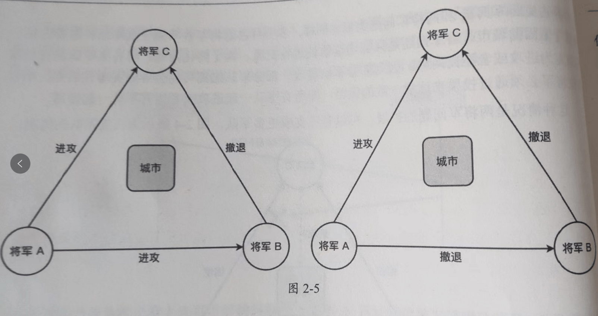
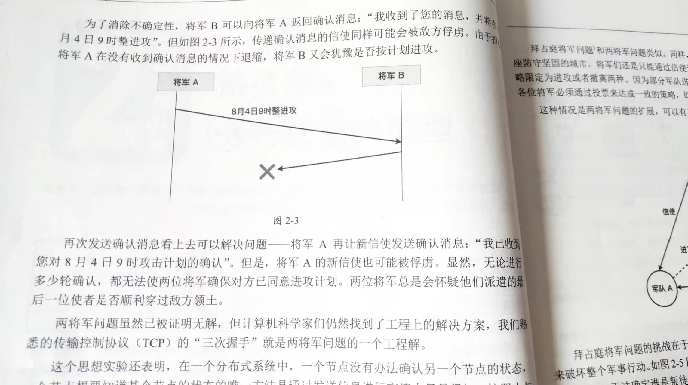
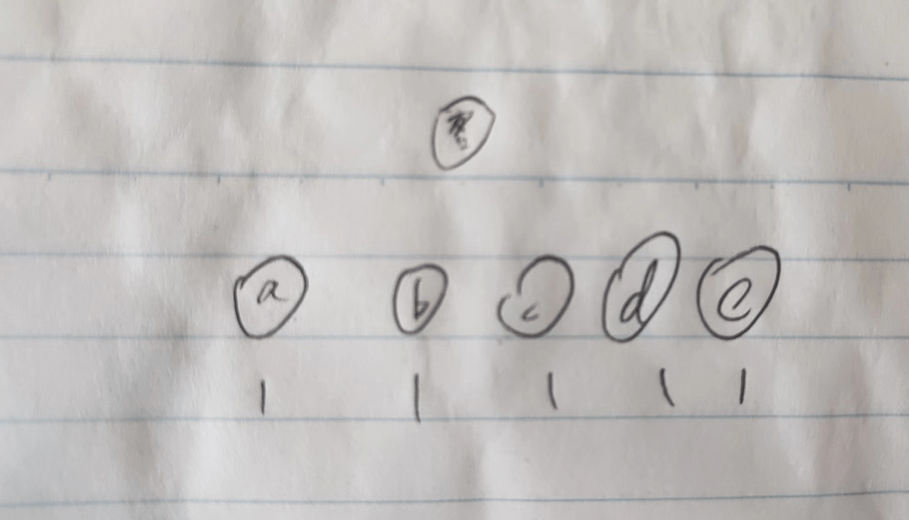
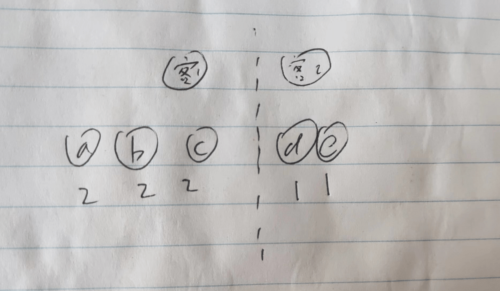
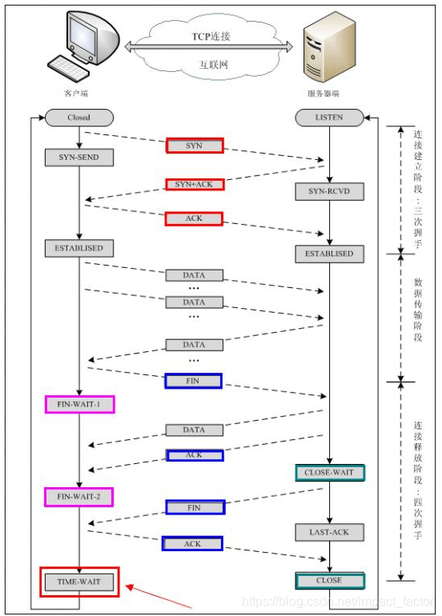

## 前言

事情要从半个月前说起，由于通勤距离比较长，通常会带一本书，最近带的书是 **《深入理解分布式系统》**，长这样：

然后在地铁上碰到一个小姑娘歪着脑袋看我拿着这本书的书皮，很可爱，而且还很有缘分的，空出了两个位置，坐到了一起。

当时在看 Paxos 算法部分的代码实现，看着她实在好奇的盯着我的书看，我决定克服社恐跟她聊聊。

先唠了唠嗑儿，了解了她的年级、课程、学习压力等等

她现在三年级，那天是去学校领暑假通知书，也许是因为父母户口在老家，所以在这边学校期末考试之后还要回老家的学校再考一次，每天作业传小程序，学习压力也不小。

再问了问她们学校的微机课，说是经常被数学老师占，老师会交一些 Word、画图等等基本操作，跟之前我小学时候的区别是，不用穿鞋套。

> PS：现在都还记得没带鞋套被老师罚站在门口

## 什么是分布式系统

接下来的对话与现实情况相比有所缩减和扩展，毕竟对三年级的小朋友来说，引导兴趣和引发思考比较重要

> 我：（指着书皮）这几个字认识么
> 
> 小萝莉：认识，**深入理解分布式系统**（一字字的念出来），但是不知道什么意思
> 
> 我：你想听一个故事么，听完就知道这本书讲的什么了
> 
> 小萝莉：想听（带点不好意思）

### 拜占庭将军问题

接下来我就把书开头的拜占庭将军问题简化的讲了讲

> 我：假如在古代，有两个将军想要进攻一个城市，他们想要进攻一个城市，需要两个人同时发起进攻，否则战争就会失败。
> 
> 那么这时就需要双方约定几日几时开始进攻，但好巧不巧两个将军中间隔了一座山，那么问题就是，**他们需要怎么传递消息，才能保证约定的时间无误呢**
> 
> 小萝莉想了想，说：可以飞鸽传书
> 
> 我：但是**鸽子也可能在半路被射下来，骑马也可能在山里迷路**
> 
> 小萝莉又说：可以放烟花，然后看到烟花就开始进攻
> 
> 我：烟花在晚上很醒目，但是白天可能看不太清楚，要是另一方没有看到烟花，行动不就失败了么
> 
> 小萝莉：我再想想，要是在现在，打一个电话过去就说清楚了
> 
> 我：电话也可能存在干扰哦，比如我们现在在地铁里，给远方的人们打电话，可能话说到一半对方就听不到了
> 
> 我：而且我们目前只提到了两个将军，**如果有五个将军要协同进攻同一个城市，而且这些将军里边可能有叛徒，会瞒报或者传递错情报，这时候要让里边的大多数好将军约定好进攻时间，会是个更复杂的问题；** 我手里拿的这本书讲的就是在计算机里是怎么解决这个问题的。

而在技术的世界中，提供稳定的服务通常有如下需求

- 高性能，一台机器的性能存在瓶颈，而且机器越贵，硬件上可提升的空间就越低

- 可扩展，数据密集型应用，无法一开始在单机上正确的预估及投入足够多的硬件，分散到多台机器上各自处理比较经济

- 高可用，单个节点提供服务有物理不能突破的上限，比如突然的断电、断网、硬件出现故障等等

而多台机器共同提供服务，就会有通信不可靠、节点不稳定、叛徒节点乱发数据等等问题。

### CAP 不可能定理

> 我：这个问题在生活中可以通过反复确认消息来确保通信的稳定，但更严谨的答案是**不可能**，在计算机领域还针对这个现象提出了一个 CAP 理论。
> 
> 我：比如你刚才提到的通过飞鸽传书的方式通信，假如将军 A 发了一个鸽子给将军 B，但同时将军 A 也需要知道这个消息传成功了没有。
> 
> 所以将军B收到消息会给将军 A 回送一个鸽子，表示自己**收到**会按照约定进攻；与此同时，将军 B 也需要知道自己送回去的鸽子有没有被将军 A 收到，又需要将军 A 再送一个鸽子过来表示『**我收到了你的收到**』，就陷入了无限的通信循环，鸽子们都要累死了。

PS：指着这张图跟他描述了上面的这个问题

而 CAP 定理有一个比较好理解的反例，假设我们有 abcde 五个节点，**正常工作时，五个节点的值都是 1**，客户端访问任意节点都会**得到一致的结果**。

然后假设机房的网线被挖掉几根，导致 abc 节点无法访问 de 两个节点，那么客户端1访问 abc 节点拿到的值与客户端2访问 de 两个节点拿到的值是不一致的（**违背了一致性**）。如果不想违背一致性，那么de 两个节点就不能返回值（**违背了可用性**）。

CAP 定理是一致性（Consistency）、可用性（Availability）、分区容错性（Partition Tolerance）的首字母缩写，其指出**在一个异步网络环境中，对于一个分布式读写存储系统来说，只能满足三项中的两项，不可能满足全部三项**。

## 现实中怎么解决

既然没有一个最完美的方案，我们就需要提高通信的成功率和可信度

> 我：虽然在理论上是不可能的，但现实生活中会有各种各样的方式来确保消息的传达成功。你之前看过士兵们执行任务么？
> 
> 小萝莉：在电视上看过
> 
> 我：他们在作战的时候一般都会有一个指挥部，士兵每次汇报战场情况都会说一句 **over**，指挥部每次下达一个命令，士兵都会回复 **收到**，假设话说到一半，信号断掉了，指挥部没有听到『收到』、『over』等关键字，就知道通信有问题，需要想办法重新联系上队伍，确保命令准确下达。
> 
> 我：刚才的两个将军问题，现在听了这么多，有想到别的办法么
> 
> 小萝莉：我们也可以建一个指挥部，跟山两头的将军发送指令，并且在他们确认收到的情况下再进攻
> 
> 我：👏

在技术上，TCP 协议通过三次握手、四次挥手尽可能保证在网络环境稳定的情况下的信息传输，RSA 非对称加密技术可以提高信息传输的安全性，避免叛徒节点中途篡改。

> 网上针对 TCP 已经有很多博客了，这里就不再赘述，感兴趣可看：[通俗易懂理解TCP协议三次握手和四次挥手及其常见问题_impact_factor的博客-CSDN博客_三次握手和四次挥手](https://blog.csdn.net/impact_factor/article/details/119394391)

以及最近的 web3.0，区块链技术，以 权益证明（POS）/工作量证明（POW）让绝大部分节点稳定的为网络做贡献

> 对这方面感兴趣的，可以看下网上博客[区块链共识机制技术一——POW(工作量证明)共识机制_a soldiers的博客-CSDN博客_pow共识](https://blog.csdn.net/qq_38491875/article/details/109029306)，或者博主之前写的区块链相关的文章，[区块链是怎样保证数据不被篡改的？ - 九层台](https://blog.wj2015.com/2022/03/22/%E5%8C%BA%E5%9D%97%E9%93%BE%E6%98%AF%E6%80%8E%E6%A0%B7%E4%BF%9D%E8%AF%81%E6%95%B0%E6%8D%AE%E4%B8%8D%E8%A2%AB%E7%AF%A1%E6%94%B9%E7%9A%84%EF%BC%9F/)

## 总结

分布式系统就是在多个节点共同提供服务的前提下，保证高性能、可扩展和高可用，CAP 定理表明，我们**无法在异步网络环境上实现一套即满足一致性、又满足可用性、还满足分区容错性的系统**。
