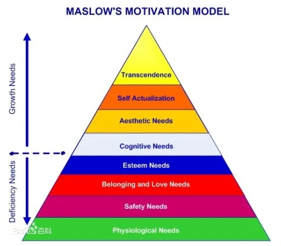
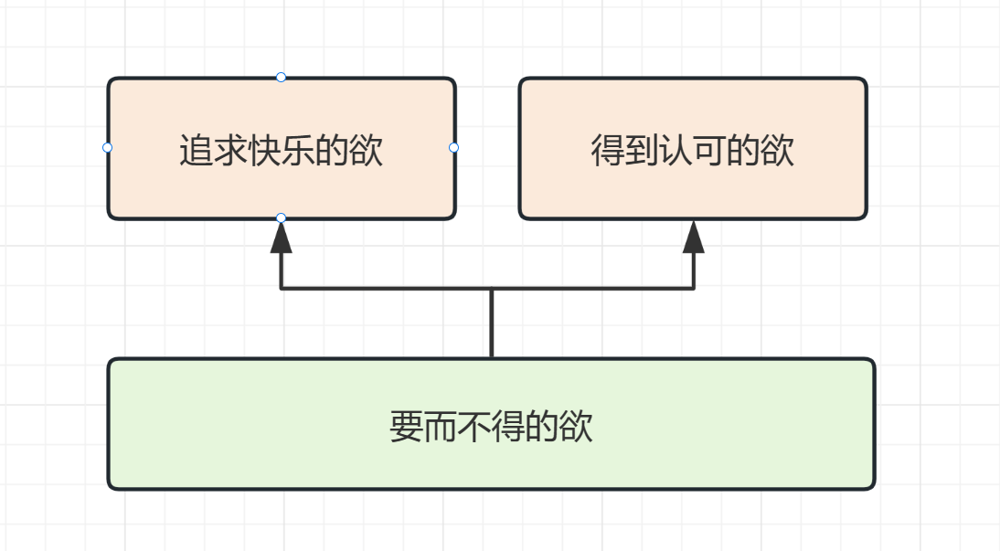
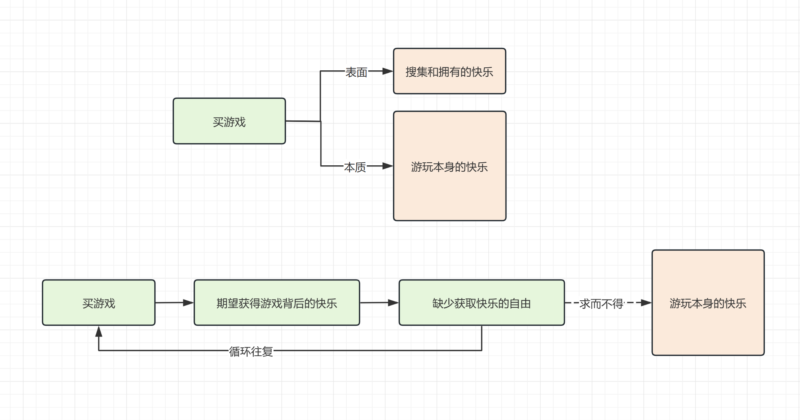

## 前言

为什么会想到这个看起来比较沉重的话题，原因之一是博主最近会明显的感觉到一丝莫名的忧愁，那种缺失某些东西的惆怅，还有一点欲而不得的压力，并且会在上下班各一个半小时的通勤时间里发酵，不断加重着社畜机械生活带来的疲惫。

那天我站在地铁门口，突然就想探究反思一下，欲求不满会导致忧郁，那么我究竟对什么有欲？为什么会有该欲？能否得到妥善的解决和舒缓？

## 对欲的分析

这里并没有把马斯洛需求层析理论搬出来，目前大部分人已经在社会生活中满足了生理需要、安全需要以及也有不少人在婚姻和社交中满足了归属和爱的需要，在这样的日常生活下剩下的那些需求描述就有些太宽泛和抽象了。

​​

于是我把近期个人生活中迸发出的让人忧郁的欲望分为下面三类：

* 追求快乐的欲，比如男生喜欢寄望于游戏带来的快乐以及有充足时间去猎取快乐的自由
* 得到认可的欲，从外在环境获得进认同，实现自我价值的欲
* 要而不得的欲，缺失选择自由时，会对无法得到的物寄予欲

​​

### 追求快乐的欲

追求更多快乐的欲可以认为是一种本能的追求，以及对日常世界的躲避，正因为日常生活中缺少这样的快乐，才会去其他地方追逐快乐。比如广义上的游戏：运动、旅行等一切愉悦自己的东西。以及生活中缺少某些自由，才会到游戏中追求自由。

### 得到认可的欲

由于表现自我、刷新他人认知带来的自我满足阈值会随时间增长越来越高。当个人能力和外界对个人的预期达到一个短期平衡的时候，会更难获得这些稀缺的嘉奖，这样会带来更多的欲，内心求之而不得的循环往复只会加强这个过程。

### 要而不得的欲

客观现实与理想期望有冲突的时候就会触动这样的欲，通常是上面两种欲望的延伸。比如我在追求打游戏的快乐时会想置办性能更强大的机器以及购买更多的游戏，但我的现实资源不允许我自由的选择想要的东西，**这种要而不得，会产生欲，理性和欲望交织就会忧郁苦闷，而且越循环越深陷**。

有一类行为叫逛淘宝，真的只逛不买，一来是希望淘到更多的东西，还喜欢在挑选商品的过程中想想它出现在自己生活中的感觉，但现实中的钱包又不允许，花时间花精力花脑力后什么也没有获得。而这时候可能花呗会跳出来，让人们可以通过透支未来实现这样的欲望，不过这就是另一个话题了。

以及标题中提到的电子阳痿更像是对快乐的要而不得，**因为现实中缺少自由游戏的时光和更多的快乐，才会这么热衷于搜集“快乐的外在实体”，但同时又没有现实条件（时间/精力/其他更容易快乐的手段）去通过这些外在实体去收获想要的快乐。**

## 如何解决和舒缓

在博主的前文 [《谈谈娱乐焦虑和电子阳痿》](https://blog.wj2015.com/2023/06/08/%E8%B0%88%E8%B0%88%E5%A8%B1%E4%B9%90%E7%84%A6%E8%99%91%E5%92%8C%E7%94%B5%E5%AD%90%E9%98%B3%E7%97%BF/)中提到了延迟满足和专注的方式与自己的本能脑和解，从欲的角度出发，短期的延迟娱乐是延缓和满足欲的一种方式，但对于众多要而不得的欲来说，还需要力所能及+有度渐进。

以电子阳痿为例，**购买更多游戏的前提，应该是我需要靠他来获得快乐，而不只是为了搜集这份快乐的外在实体**。不然短期可能会因为搜集和拥有实体而得到快乐，长期来看拥有的只是对游戏内容和自由游戏时间的求而不得的欲。当一件游戏商品不能带给我它最重要的提供快乐的价值，我在现在拥有了它与我没有它又有什么样的本质区别呢？

​​​​

追求快乐的欲，这与跟纯粹的热爱搜集有所区别，搜集的目标是获得外在实体，而大多数买游戏不玩的行为是在追求游玩游戏背后的快乐。但也并不是一刀切完全阻止自己去了解和翻阅各种各样感兴趣的内容，因为这本身也是一种快乐，只是不要把自己一直置于求而不得的漩涡中。

得到认可的欲，对应的是人的被赞美被认可的基础需求，也许**我们需要更多的理智去思考，增加更多的自我认同的基石，而不只是寄望于外界不稳定的稀缺的正反馈**。

要而不得的欲，**本质上是理想和现实的冲突**，虽然有很多东西无法立即拿到，但可以在力所能及的范围内满足自己，就如我没有可以玩4k@60hz游戏的设备，但我可以降低分辨率，可以游玩前作，可以玩其他能带给我快乐的东西。也可以做延迟满足，给自己积累现实条件的时间（金钱，状态等）未来再购入做延迟满足。**如果一直纠结于没有办法获得的快乐载体而非尝试去获取快乐本身，就会陷入要而不得的欲望漩涡中**。

整理了几个关键词：

* 面对追求快乐的欲，应思考快乐本身的价值在何处，理智行动
* 得到认可的欲，应增加更多自我认同的基石，客观看待世界
* 要而不得的欲，应力所能及，辅以延迟满足，不要落于欲望的外在，更应落于本质

## 尾声

博主尝试过梳理了自己最近萌生的各种欲并一一思考，没有这些致郁的欲的干扰后，会更容易专注于应该做的事情上，心里不会一直有郁郁的压力，也不会不时望着自己想要的东西流口水影响节奏。

不过每个人的情况和问题是不一样的，重要的是在自己烦郁的时候也要去思考自己情绪的根源，希望能给你一些启发。
