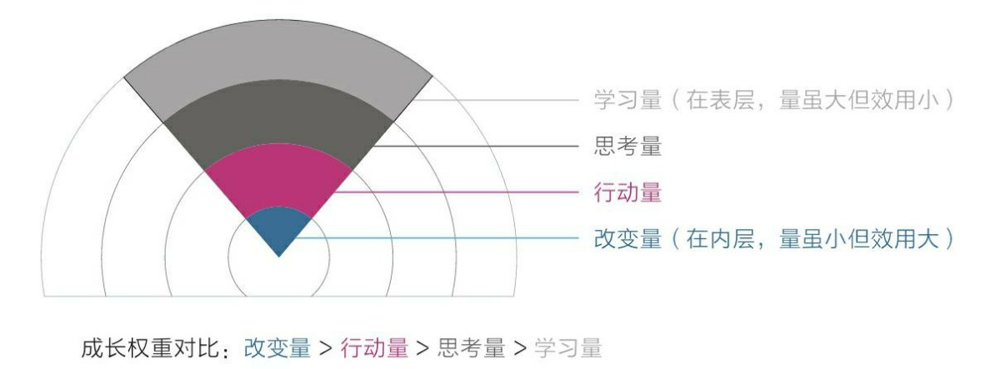

## 前言

开始本篇文章之前，想跟大伙儿交流下病情，不知道你们有没有遇到过这样的场景：

- 每天下班路上心潮澎拜，想着回去可以做一下 XXX 提升一下个人技术力，但又惯性的点个外卖/下碗面条，拿着手机边吃饭边刷视频，然后眼睁睁看着时间跑到了11点，愈发觉得休息时间这么短，明天又要早起上班，在着一丝焦虑的心情中失眠，接着拿起了手机希望快乐的时间能延长一点

- 克服了一切困难，坐到了电脑面前开机，打开浏览器，突然想了解下国（鸡）家（毛）大（蒜）事（皮），然后就输入了 zhihu.com，刷他一个小时，直到头晕脑热心情疲倦，一看时间凌晨11点，心里想着今天怎么又啥也没干，带着丝丝焦虑入眠

- 做正事儿的时候走了个神，想到同龄人已经年入 xx 万，买房买车抚育下一代了，自己却好像还在一个地方转圈，想着想着心理心里逐渐焦虑，最后事情也没做好，焦虑却更加严重了

再以及电子阳痿症：

- Steam 愿望单里期待了好久的游戏，突然骨折 90%，赶紧登录账号一顿买，然后下载完成之后，心中纠结犹豫要不要等一个连续的好一点的时间再打开呢，到最后它的结局就是占着硬盘空间吃灰

- 心潮澎湃买了个 switch，整天盯着数字商店刷哪个游戏打折，看着评价和截图一阵哇塞买买买，512G的存储装满后发现真正打开玩完的游戏寥寥无几

上面的示例都来自博主自己以及与博主倾诉的朋友们，不知道有多少小伙伴对此有切身体会呢。

## 关于焦虑

相比电子阳痿，博主更想先了解下焦虑是怎么一回事，那么要想了解一个事物产生的原因，首先得了解它是什么，比如百度百科：

> 焦虑（Anxiety）是指个人对即将来临的、可能会造成的危险或威胁所产生的紧张、不安、忧虑、烦恼等不愉快的复杂情绪状态。

#### 成长焦虑

分析一下前言中提到的第一个例子，在回家路上想着提升个人技能，但到家后又在惯性下投入到重复而又无效娱乐活动中。

这里的技能成长焦虑对应的危险就是“世界变化这么快，不抓紧时间学习就会被淘汰”，所以理智告诉我“回去把 xx 学了吧，以后在 xx 场景可能用上”，但实际的表现却是吃饭刷手机睡觉，**这样的行动只会让“被淘汰”这个危险可能性变得更大了，离目标越来越远，那么焦虑就在其中逐渐加深**。

成长的焦虑还会一些辅助原因，比如学习本身就是费脑力的，带着困难的，相比面对困难，荡漾在愉悦的信息流中不是更舒适么？

#### 物质焦虑

再思考一下前言中提到的第三个例子，相比同龄人，自己不足的地方有很多，焦虑的质问自己为什么自己达不到那样的高度。

这里的物质焦虑对应的危险就是“反观自身，**发现与之前同级的人差异已经逐渐拉开，有被歧视、脱离群体的危险**”

这时候我们看到的是结果，甚至不知道他们是如何一步步拉开差距的，更别说自己要如何做，全都是模糊的一团，一直沉浸在这样的情绪反应中是解决不了问题的，我们需要找到焦虑的本质并应对它。

### 焦虑的本质

其本质在定义里边说了，我个人觉得很准确，就是**对威胁、危险的个人情绪反应**；

但焦虑持久存在还有一些深层次的原因，比如：

- **急于求成，想同时做很多事**，结果给自己的目标越来越大和困难越来越多，分心乏术又带着痛苦的继续往上爬

- **趋易避难，想不怎么努力就看到好的效果；** 实施过程中总是在自己可以轻易做到的事情上打转，花了时间却又很难看到提升的效果，每天完成打卡任务似的应付自己。

- **重形式，轻实践；** 看了无数的书籍和教程，但实际上手的时间屈指可数，过了半个月，发现自己之前会的东西全忘了，又不想再重新学一遍，于是这一个大难关就一直埋在心里，时不时出来刺激自己一下

## 如何应对？

那么理解这些原因之后，我们一点点的刨析就可以想办法应对它

#### 保持耐心

**有一个实用技巧叫做“延迟满足”**，理论是这样讲的，让人沉浸在愉悦的信息流中的是人类自进化以来保留的 **“潜意识”追逐低能耗的天性**，动脑是高能耗的运动，而刷抖音并不需要动脑，只需要躺着享受就好了。

而我们的“理智脑”是可以克服这种本能的冲动，让自己做最理性最正确的事情的；不过应该都知道，克服本能是很难受的，因为“潜意识”会不停的反抗说“我们应该做低能耗且享受的事情”；

> “找一个自己能坚持做下去的方式，比单纯按照标准化的时间和方式做更重要”
> 
> 适当降低难度和标准，会持续得更久，感到不适只靠专注硬撑容易被潜意识抗拒。

减少这种反抗就可以使用“延迟满足”的技巧，在理智脑思考的霎那，我们把当下刷抖音、刷知乎的**快乐留到完成某个小目标后**，完成这个小目标在自己专注的前提下大概需要多少时间自己心里都有数，然后等待片刻，**让心里衡量一下“带着焦虑去追求快乐”和“等一段时间目标达成就可以无忧无虑的快乐”两者的得失，追求确定性和单一性的“潜意识”一般都不会拒绝，并且也不会在处理任务期间打扰到“理智”**，专注度和效率也会得到提升。

长此以往形成习惯，在娱乐前做一些沉浸式的阶段性的任务，在任务完成之后专注的享受一段娱乐，“理智”和“潜意识”互利共赢。

#### 保持专注

不知道多少人会在走路的时候刷抖音，吃饭的时候看动漫，博主之前一直也不觉其害，甚至觉得筷子跟手机简直绝配，一心二用赚爆了。

但一些习惯会逐渐演化为：工作的时候走神，准备看书的时候被手机信息流吸引，~~陪老婆逛街的时候看美女（划掉）~~

危害都懂在此不表，这种状态下，我们在躯壳内装了一个混乱的灵魂，这个灵魂总是“做A想B”：刷牙的时候走神，走路的时候走神，洗澡的时候走神……无时无刻不在走神。

**分心的本质是一种趋易避难的逃避天性**，原因无非两个：

- 一是觉得当下太无聊，所以追求更有意思的事情；

- 二是觉得当下太痛苦，于是追求更舒适的事情。因为身体受困于现实，只好让思想天马行空。

保持专注也并非学霸专属，正如李大钊同志教育孩子所述：

> “做什么事情都不能三心二意，要学就学个踏实，要玩就玩个痛快。” --李大钊

可以从小事做起，吃饭的时候享受美食，工作的时候专注工作，学习的时候屏蔽无关干扰，玩游戏的时候时刻留神战场动态，养成专注的习惯。

#### 少即是多，多既是少

看书也好、看视频也罢，都是获取信息的一个方面，看完这一段话，是左耳朵进右耳朵出呢，还是停下来反思一下自己的日常，尝试定制一些可行措施呢？ **学习层投入再多努力，也需要思考实践和改变，** 大家都看完了这一段文字，但最终的收获差别可能是很大的。

这里有一个技巧叫做，“熔断不读书法”，意思就是在读书时一旦看到有启发的内容，就触发熔断点，立刻停止阅读。停止阅读之后做什么呢？围绕这个触发点对自己提问。

- 为什么刚才这个点让我有启发？

- 我能够把这个启发点用在3个不同的事情上吗？

- 这个启发点有没有其他类似的知识？

#### 目标明确，拒绝模糊

缺乏自我观察意识的人只能无意识地顺着感觉和喜好行事，无论在生理上还是在精神上，都会不自觉地追求眼前的舒适和简单，觉察不到自己当前的思维和行为有什么不妥，直到碰壁。

> 如果人生是大海，那我们每个人都是一条小船，自我认知能力强的人会时刻掌握方向舵，主动控制生命之船的航向，而认知能力弱的人总是喜欢待在甲板上当个忙碌的水手，至于船嘛，漂到哪里算哪里……

我们会更喜欢给自己一个大目标、大梦想，比如数学考到140、长大住大house、成为一名歌手万人迷，**但这种目标都是大而模糊的，能具体实现的目标应该是清晰且细化的**，所以合理的拆分为小而明确的目标并逐步实现，才会离自己的大追求越来越近。

这个过程就类似深度学习中的梯度下降，我们不能指望一次性就找到一个最合理的权重，但每一次改变都会离我们的方向更进一步。

### 电子阳痿

思考完焦虑，反过头来看“电子阳痿”，我相信有很多人为了生活真的不会有时间玩游戏，久而久之反而对曾今最渴望的娱乐手段提不起兴趣，甚至感到陌生。

想想小时候能玩上那么一会儿超级玛丽，4399，街机都能兴奋好久，现在各种娱乐设备触手可及但又提不起兴致，心里确实会感到那么一丝无奈。

不怕丢人，博主就是那个买了 switch，游戏塞满了内存卡，却没玩几个的深度患者；但对于那些需要持续占领心智思考，体验时间很长的游戏提不起精神，**其中一个主要原因还是专注**

比如我知道解决这个谜题推进剧情、花很长时间沉静在故事里会让我很开心，但是追求确定和节能的“潜意识”还是会让我选择刷刷刷就能重复获得快乐和爽感的游戏，或者转向刷一刷就能获得多巴胺奖励的短视频。

在娱乐多元化的时代，选择什么样的娱乐方式萝卜青菜各有所爱，对博主个人来说，做到 “要学就学个踏实，要玩就玩个痛快。”，**不要在学习工作的时候想着娱乐，在娱乐的时候焦虑未来，这就足够了**！

## 总结

某位冬泳博主曾说：“消除恐惧的最好办法就是面对恐惧，加油，奥利给！”

认知是一回事，行动和改变是另一回事，从小事做起，保持耐心，保持专注，然后逐渐变得更好！

部分文字、图片素材、观点引入自《认知觉醒：开启自我改变的原动力》，非常棒的一本书，推荐阅读。
